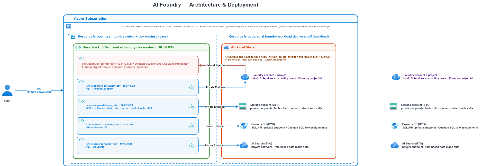

# AI Foundry Lab

Foundry Agent Service with a **BYO stateful stack** — Storage, Cosmos DB, and AI Search stay in your subscription and are wired to Foundry via managed-identity connections and capability hosts, with a fully-private VNet.

This lab is split into two Terraform stacks:

| Stack | Purpose | Runs from |
|---|---|---|
| [`base/`](base/terraform/) | Shared network (VNet, subnets, NAT, DNS zones) + jumpbox + self-hosted GitHub Actions runner. | `ubuntu-latest` (GitHub-hosted) |
| [`workload/`](workload/terraform/) | Foundry account, project, capability hosts + BYO Storage/Cosmos/AI Search + private endpoints. Everything here has `public_network_access_enabled = false`. | `[self-hosted, ai-foundry]` (the runner from `base/`) |

Why the split: workload data-plane operations (Cosmos SQL role assignments, Foundry capability host provisioning, Storage container access) need to reach services whose public network access is disabled. A GitHub-hosted runner can't reach them — the self-hosted runner living inside the VNet can.

## Architecture



Source: [assets/architecture.drawio](assets/architecture.drawio) (editable) &nbsp; · &nbsp; PNG: [assets/architecture.png](assets/architecture.png) &nbsp; · &nbsp; Icons: [assets/icons/](assets/icons/)

**Structure (following Azure diagramming best practices):**

- The **Customer VNet** is the outermost container on the left.
- Each **subnet** is a nested container inside the VNet.
- Each **private endpoint** (PE) icon sits *inside* its subnet.
- Lines go from each PE **out to the target service** (Foundry account or a BYO service) on the right.
- The **agent runtime subnet** has a separate red arrow to the Foundry account labelled "network injection" — that subnet's IPs are consumed by Foundry Agent Service compute, not by a private endpoint.

Everything on the right (Foundry account + BYO services) has `public network access = Disabled`, so those PE lines are the *only* way in.

### Viewing / editing the diagram

- **Inline**: the PNG above is regenerated from `assets/architecture.drawio`. Re-export whenever the source changes so GitHub picks it up.
- **VS Code**: install the [Draw.io Integration](https://marketplace.visualstudio.com/items?itemName=hediet.vscode-drawio) extension and open the `.drawio` file — it renders inline and stays editable.
- **Browser**: open [diagrams.net](https://app.diagrams.net) → *File → Open from Device* and pick the `.drawio` file (make sure the `icons/` folder is beside it so the SVG references resolve).
- **Regenerate the PNG**: *File → Export as → PNG*, save to `assets/architecture.png`.

## What each stack creates

### `base/` — network, jumpbox, runner

- **1 VNet** (`10.0.0.0/16`) with **7 subnets** via [subnet/v1](../../iac-modules/terraform/subnet/v1/main.tf):
  - 4 private-endpoint subnets: `snet-cognitive`, `snet-storage`, `snet-cosmos`, `snet-search`
  - 1 agent-runtime subnet delegated to `Microsoft.App/environments`
  - `snet-cicd` for the GitHub Actions runner
  - `snet-jumpbox` for the operator jumpbox
- **11 private DNS zones** (3 for Foundry, 6 for Storage, 1 for Cosmos, 1 for Search) linked to the VNet via [private_dns_zone/v1](../../iac-modules/terraform/private_dns_zone/v1/main.tf).
- **NAT gateway** attached to `snet-cicd` + `snet-jumpbox` so both VMs have outbound Internet to GitHub, apt, and Azure ARM.
- **Jumpbox** via [jumpbox/v1](../../iac-modules/terraform/jumpbox/v1/main.tf) — Ubuntu 22.04, public IP with SSH allowlist, Entra ID SSH login enabled.
- **CI/CD runner** via [cicd_runner/v1](../../iac-modules/terraform/cicd_runner/v1/main.tf) — Ubuntu 22.04, no public IP, UAMI, cloud-init that installs Azure CLI + Terraform + tflint and registers the runner against your repo with a fresh registration token minted from your PAT.
- **Auth**: both terraform workflows authenticate to Azure as a single App Registration you create manually in Prereq A (see [Authentication model](#authentication-model)). The runner VM's UAMI is only attached for potential future VM-local use; the CI workflows don't rely on it.

### `workload/` — Foundry, BYO services, capability hosts

- **BYO data plane** via [cosmos_db/v1](../../iac-modules/terraform/cosmos_db/v1/main.tf), [storage account/v1](../../iac-modules/terraform/storage%20account/v1/main.tf), and [ai_search/v1](../../iac-modules/terraform/ai_search/v1/main.tf). All have public network disabled, local auth disabled, SystemAssigned MI, and private endpoints into the corresponding subnets from `base/`.
- **Foundry account** via [cognitive_account/v1](../../iac-modules/terraform/cognitive_account/v1/main.tf) — `kind = "AIServices"`, `project_management_enabled = true`, network injection into the agent subnet from `base/`.
- **Foundry project + capability hosts** via [foundry_project/v1](../../iac-modules/terraform/foundry_project/v1/main.tf) — creates the project MI, grants Phase-3 and Phase-5 RBAC, waits 60s for RBAC propagation, then creates the account and project capability hosts that bind the three BYO connections into Agent Service.

Workload references everything in `base/` via `data` sources (by name), so the two stacks don't share state files — only the naming convention encoded in `locals` at the top of both `main.tf` files.

## Authentication model

Pure OIDC + managed identities. **Zero client secrets, zero account keys, anywhere.** Follows the standard pattern documented in the [root README](../../README.md#configure-new-app-registration-in-microsoft-entra-id) — one App Registration federated to specific GitHub environments.

### Identities

| # | Identity | Kind | Created by | Used for |
|---|---|---|---|---|
| 1 | `cpi-ai-foundry` App Registration | Entra ID App Registration (no client secret) | You, once, in Prereq A (Azure Portal) | `azure/login@v2` OIDC from every terraform workflow |
| 2 | Foundry project MI | SystemAssigned on `azurerm_cognitive_account_project` | Workload Terraform | Foundry Agent Service runtime → BYO Storage/Cosmos/Search |

Plus SystemAssigned MIs on Storage, Cosmos, AI Search, Cognitive account (created by their modules for outbound integrations if ever needed) and a UAMI attached to the runner VM (for potential future VM-local scripts via `az login --identity` — not used for CI auth).

### All auth flows

| # | From | To | Mechanism |
|---|---|---|---|
| 1 | Bootstrap GitHub Environments workflow | GitHub API | `gh` CLI with `GH_TOKEN=GH_ADMIN_PAT` — writes env-scoped secrets/vars |
| 2 | Terraform Init Remote Backend (ai-foundry) | Azure ARM + Storage data plane | App Registration via OIDC (`repo:{owner}/{repo}:environment:ai-foundry` subject) |
| 3 | Base plan/apply | Azure ARM + Storage state backend (`tfstate-base/base.tfstate`) | App Registration via OIDC (`ARM_USE_OIDC=true` + `ARM_USE_AZUREAD=true`); backend needs Storage Blob Data Contributor at subscription scope |
| 4 | Runner VM cloud-init | GitHub API | Fine-grained PAT `GH_RUNNER_PAT` — mints a runner-registration token at first boot |
| 5 | Workload plan/apply | Azure ARM + Storage state backend (`tfstate-workload/workload.tfstate`) + Cognitive/Cosmos/Search/Storage data planes | Same App Registration via OIDC — same federated credential subject as base because both stacks run under the same `ai-foundry` GitHub environment (differentiated by the `stack` dispatch input). Runner VM only provides network path into the VNet. |
| 6 | Foundry project MI | Storage / Cosmos / AI Search | Entra ID over private endpoints, routed through the three `azurerm_cognitive_account_connection_entra_id` records that the project capability host binds into Agent Service. RBAC granted during workload apply (see roster below). |
| 7 | Operator | Jumpbox VM | `az ssh vm` (Entra ID SSH) via `AADSSHLoginForLinux` VM extension |
| 8 | Operator | Runner VM (diagnostics only) | `az vm run-command invoke` — control-plane; no SSH (runner NSG denies inbound at priority 4000) |

**Local (key-based) auth is disabled** on the Cognitive account, Storage, Cosmos, and AI Search. `storage_use_azuread = true` in the workload provider forces Terraform's storage data-plane calls through Entra ID.

> **A note on OIDC subject format.** The subjects above (`repo:{owner}/{repo}:environment:...`) are GitHub's traditional format. Some newer repositories use immutable subjects that include repo/org IDs (`repo:{owner}@{owner-id}/{repo}@{repo-id}:environment:...`). The Azure Portal wizard for GitHub Actions federated credentials fills in whichever your repo uses — always accept exactly what the wizard generates, don't hand-type it.

### GitHub secrets & variables inventory

**Repo-level secrets** (set manually in Prereq B):

| Name | Purpose |
|---|---|
| `AZURE_CLIENT_ID` | App Registration client ID — used by every workflow via `azure/login@v2` |
| `AZURE_TENANT_ID` | Directory (tenant) ID |
| `AZURE_SUBSCRIPTION_ID` | Target subscription ID |
| `GH_ADMIN_PAT` | Fine-grained PAT — bootstrap workflow uses this to write env-scoped secrets/vars |

**Env-scoped secrets** (populated by Step 1 into `ai-foundry`):

| Name | Value used for |
|---|---|
| `TAGS` | Applied to the RG at creation time by `terraform-init-backend.yaml` |
| `ADMIN_SSH_PUBLIC_KEY` | `TF_VAR_admin_ssh_public_key` — jumpbox + runner SSH key |
| `GH_RUNNER_PAT` | `TF_VAR_github_pat` — cloud-init on runner VM |

**Env-scoped variables** on `ai-foundry` (populated by Step 1):

| Name | Value | Purpose |
|---|---|---|
| `RESOURCE_GROUP`, `LOCATION`, `STORAGE_ACCOUNT`, `STORAGE_ACCOUNT_SKU`, `STORAGE_ACCOUNT_ENCRYPTION_SERVICES`, `STORAGE_ACCOUNT_MIN_TLS_VERSION`, `STORAGE_ACCOUNT_PUBLIC_NETWORK_ACCESS` | shape values | RG + state SA configuration |
| `ALLOWED_SSH_SOURCE_PREFIXES` | JSON list of CIDRs | `TF_VAR_allowed_ssh_source_prefixes` — jumpbox NSG allowlist |
| `JUMPBOX_ENTRA_ADMIN_OBJECT_IDS` | JSON list | `TF_VAR_jumpbox_entra_admin_object_ids` — VM Admin Login grantees |
| `TERRAFORM_WORKING_DIRECTORY` | `environments/ai-foundry` (base path) | The reusable workflow appends `/base/terraform` or `/workload/terraform` at dispatch time using the `stack` input. |

**Not stored as env vars** — derived at dispatch time by the reusable workflow:

| Name | Value | Derived from |
|---|---|---|
| `TERRAFORM_STATE_CONTAINER` | `tfstate-base` or `tfstate-workload` | `format('tfstate-{0}', inputs.stack)` |
| `TERRAFORM_STATE_BLOB` | `base.tfstate` or `workload.tfstate` | `format('{0}.tfstate', inputs.stack)` |

`TF_VAR_github_org` and `TF_VAR_github_repo` are NOT stored — they're derived at workflow runtime from `${{ github.repository_owner }}` and `${{ github.event.repository.name }}`.

### RBAC roster

**App Registration** — `cpi-ai-foundry` (granted manually in Prereq A):

| Role | Scope | Why |
|---|---|---|
| Owner | Subscription | Create RG + all Azure resources during both base and workload apply; grant phase-3/5 role assignments during workload apply |
| Storage Blob Data Contributor | Subscription | Terraform state backend via `ARM_USE_AZUREAD=true`; `az storage container create --auth-mode login` in init-backend |

**Foundry project MI** (SystemAssigned, granted by `foundry_project/v1`):

| Phase | Role | Scope | Why |
|---|---|---|---|
| 3 | Cosmos DB Operator | Cosmos account | Foundry creates `enterprise_memory` DB + containers |
| 3 | Storage Account Contributor | Storage account | Foundry creates agent blob containers |
| 5 | Search Index Data Contributor | AI Search | Agents read/write vector indexes |
| 5 | Search Service Contributor | AI Search | Agents create indexes on demand |
| 5 | Storage Blob Data Owner | Storage account | Agents read/write files in the auto-created containers |
| 5 | Cosmos DB Built-in Data Contributor | Cosmos account | Agents read/write threads in `enterprise_memory` |

**Jumpbox operator logins** — Entra objects listed in `JUMPBOX_ENTRA_ADMIN_OBJECT_IDS` (granted by `jumpbox/v1`):

| Role | Scope | Why |
|---|---|---|
| Virtual Machine Administrator Login | Jumpbox VM | Enables `az ssh vm` with AAD auth (via `AADSSHLoginForLinux` extension) |

### Federated identity credentials

One federated credential on the App Registration created in Prereq A:

| Subject | Used from |
|---|---|
| `repo:{owner}/{repo}:environment:ai-foundry` | Every terraform workflow (init-backend, base plan/apply, workload plan/apply) |

Issuer: `https://token.actions.githubusercontent.com`. Audience: `api://AzureADTokenExchange`.

### Public network access

Every workload data-plane service has `public_network_access_enabled = false`:

- Foundry account (Cognitive AIServices)
- Storage account
- Cosmos DB
- AI Search

The **state storage account** starts each terraform workflow with public network access toggled ON (so the runner can reach the blob endpoint from its NAT-gateway public egress) and gets toggled OFF at exit via a `trap`. Final state after every workflow run is `Disabled`.

## Prereq resource providers

Registered idempotently via `resource_providers_to_register` in each stack's `providers.tf`. Combined across both stacks: `Microsoft.App`, `Microsoft.CognitiveServices`, `Microsoft.Compute`, `Microsoft.ContainerService`, `Microsoft.DocumentDB`, `Microsoft.KeyVault`, `Microsoft.MachineLearningServices`, `Microsoft.ManagedIdentity`, `Microsoft.Network`, `Microsoft.Search`, `Microsoft.Storage`.

---


## Deploy — CI-only

Four workflow runs (the last two are stack-specific and each need one manual approval). The prereqs follow the standard repo pattern documented in the [root README](../../README.md#configure-new-app-registration-in-microsoft-entra-id) — one App Registration in Entra ID with one federated credential, no client secret anywhere.

### Prereq A. Create the App Registration in Entra ID (~5 minutes)

Portal UI, all clicks — no local CLI. Same pattern the root README describes for every other env in this repo.

1. Azure Portal → **Microsoft Entra ID** → **App registrations** → **New registration**.
   - Name: e.g. `cpi-ai-foundry` (any name works).
   - Supported account types: default (single tenant).
   - Redirect URI: leave blank.
   - Click **Register**.
2. On the app's overview page, copy three values into a scratchpad — you'll set them as GitHub secrets in Prereq B:
   - **Application (client) ID** → `AZURE_CLIENT_ID`
   - **Directory (tenant) ID** → `AZURE_TENANT_ID`
   - Then Azure Portal → **Subscriptions** → your subscription → copy the ID → `AZURE_SUBSCRIPTION_ID`
3. On the app: **Certificates & secrets** → **Federated credentials** → **Add credential**. Add ONE credential:
   - Federated credential scenario: **GitHub Actions deploying Azure resources**
   - Organization: your GitHub org / username
   - Repository: this repo name
   - Entity type: **Environment**
   - GitHub environment name: `ai-foundry`
   - Name (auto-suggested is fine): `ai-foundry`
   - Save.

   > Both Terraform stacks (base + workload) authenticate through this single federated credential because both run under the same `ai-foundry` GitHub environment. The stack they deploy is selected at workflow-dispatch time via a separate `stack` input.

4. Grant the App Registration the roles it needs at **subscription scope**:
   - **Owner** — to create the RG and all resources, and to grant phase-3/5 role assignments during workload apply.
   - **Storage Blob Data Contributor** — for the Terraform state backend (which uses `ARM_USE_AZUREAD=true`) and for `az storage container create --auth-mode login` in the init-backend workflow.

   Portal: **Subscriptions** → your subscription → **Access control (IAM)** → **Add role assignment**. Twice, once for each role. Assign to the app registration you just created.

> Contributor + User Access Administrator is functionally equivalent to Owner if you prefer least-privilege naming, but you still need Storage Blob Data Contributor separately either way.

### Prereq B. Create GitHub PATs + repo secrets (~4 minutes)

**Two fine-grained PATs.** Create both at https://github.com/settings/personal-access-tokens/new — scope each to only this repository.

| PAT | Repository permissions | Purpose |
|---|---|---|
| `GH_ADMIN_PAT` | Environments r/w · Secrets r/w · Variables r/w · Metadata r | The bootstrap workflow uses this to create the `ai-foundry` environment and write its scoped secrets/vars. |
| `GH_RUNNER_PAT` | Administration r/w · Metadata r | Cloud-init on the runner VM uses this to mint fresh runner-registration tokens. Passed to the bootstrap workflow as an input. |

**Four repo-level secrets.** Repo → Settings → Secrets and variables → Actions → *New repository secret*:

| Name | Value |
|---|---|
| `AZURE_CLIENT_ID` | Application (client) ID from Prereq A step 2 |
| `AZURE_TENANT_ID` | Directory (tenant) ID from Prereq A step 2 |
| `AZURE_SUBSCRIPTION_ID` | Subscription ID from Prereq A step 2 |
| `GH_ADMIN_PAT` | The admin PAT you just created |

Hold on to `GH_RUNNER_PAT` — it's an input to Step 1.

> **Why repo-level for AZURE_***? Both Terraform stacks share one GitHub environment (`ai-foundry`) and one App Registration; repo-level keeps them de-duplicated and matches the root README pattern.

---

### Step 1. Actions → *Bootstrap GitHub Environments* → *Run workflow*

Fill in 5 required inputs + 2 optional. `github_runner_pat` is masked in logs.

| Input | Value |
|---|---|
| `state_storage_account_name` | Globally-unique 3-24 lowercase alphanumerics, e.g. `staifoundry123456`. |
| `admin_ssh_public_key` | Output of `cat ~/.ssh/id_ed25519.pub` on your laptop. |
| `github_runner_pat` | `GH_RUNNER_PAT` from Prereq B. |
| `allowed_ssh_source_prefixes` | JSON list of CIDRs allowed to SSH the jumpbox, e.g. `["203.0.113.42/32"]`. Get your egress IP at https://ifconfig.me. Never `["0.0.0.0/0"]`. |
| `jumpbox_entra_admin_object_ids` | JSON list of Entra object IDs (users/groups) allowed to `az ssh vm` the jumpbox. Find yours in Entra ID → Users → your account → Object ID. |
| `resource_group_name` (optional) | Default `rg-ai-foundry-dev`. |
| `tags` (optional) | Default `environment=dev workload=ai-foundry`. |

Takes ~15 seconds. Preflight verifies that Prereq B set the three `AZURE_*` repo secrets before writing anything. Also cleans up the legacy `ai-foundry-base` and `ai-foundry-workload` environments if they exist from an earlier iteration.

**Verify** (workflow log tail):

```
Bootstrap complete.
  ai-foundry: 3 secrets + 9 variables

TERRAFORM_STATE_CONTAINER and TERRAFORM_STATE_BLOB are NOT stored;
they are derived at dispatch time from the 'stack' input.
```

Re-run any time to rotate `GH_RUNNER_PAT`, change the SSH allowlist, etc. — it's idempotent.

---

### Step 2. Actions → *Terraform Init Remote Backend* → *Run workflow*

Environment: **`ai-foundry`**. Takes ~2 minutes.

Creates the resource group + state storage account + **both** state containers (`tfstate-base` and `tfstate-workload` — the two Terraform stacks get physically separate containers). Public network access ends `Disabled` (the workflow's `trap`).

**Verify**: workflow log shows both container-create steps succeeding.

---

### Step 3. Actions → *Terraform Plan, Approve, Apply* → *Run workflow*

Environment: **`ai-foundry`**, **stack: `base`**. Runs on `ubuntu-latest`. Takes **~10–15 minutes** end-to-end.

The workflow derives the working directory (`environments/ai-foundry/base/terraform`), the state container (`tfstate-base`), and the state blob (`base.tfstate`) automatically from the stack input.

When the approval issue opens, comment `approved` (or click the button in the issue) to continue.

**Verify**: workflow log shows `Apply complete!` and lists the outputs (VNet name, jumpbox / runner VM names, jumpbox public IP). Wait for the runner to come online (Step 4) before running the workload stack.

---

### Step 4. (~5–15 minutes wait) Verify the self-hosted runner is online

Repo → Settings → Actions → Runners. Wait for `vm-playground-dev-runner` to show `Idle` with labels `self-hosted, linux, ai-foundry`. Cloud-init downloads and installs packages, so first-boot registration takes 5–15 minutes after Step 3 finishes.

If the runner doesn't come online after 15 minutes, see the [troubleshooting appendix](#appendix-a--optional-local-debugging).

---

### Step 5. Actions → *Terraform Plan, Approve, Apply* → *Run workflow*

Environment: **`ai-foundry`**, **stack: `workload`**. The caller workflow auto-selects `runs-on: [self-hosted, ai-foundry]` when `stack=workload`, so it lands on the runner from Step 4. Working directory becomes `environments/ai-foundry/workload/terraform`; state lives in `tfstate-workload/workload.tfstate`.

Takes **~15–20 minutes** (Storage + Cosmos + AI Search + Foundry account + 4 private endpoints + capability hosts + 60s RBAC-propagation wait).

Approve the plan when the issue opens.

**Verify**: workflow log ends with `Apply complete!`. You now have the full Foundry Agent Service stack deployed on private endpoints.

---

## Appendix A — Optional local debugging

Nothing below is required for the happy path. Use only if a workflow fails and you need to poke at the deployed resources.

### Diagnose runner cloud-init from your laptop

SSH to the runner is blocked (its NSG denies all inbound at priority 4000). Use Azure's built-in run-command instead — no network path required, no SSH keys:

```bash
az vm run-command invoke \
  --resource-group rg-ai-foundry-dev \
  --name vm-playground-dev-runner \
  --command-id RunShellScript \
  --scripts "sudo tail -n 200 /var/log/cloud-init-output.log"

az vm run-command invoke \
  --resource-group rg-ai-foundry-dev \
  --name vm-playground-dev-runner \
  --command-id RunShellScript \
  --scripts "sudo systemctl status 'actions.runner.*.service' --no-pager"
```

Common failures:

| Log line contains | Cause | Fix |
|---|---|---|
| `Failed to mint runner registration token` | `GH_RUNNER_PAT` scope is wrong | Regenerate with `Administration: r/w`, re-run Step 1, then re-run Step 3 (base apply). The runner VM is tainted implicitly if the cloud-init input changes; otherwise `terraform taint module.cicd_runner.azurerm_linux_virtual_machine.this` first. |
| `Could not resolve host: api.github.com` | NAT gateway not attached | Should not happen if base applied cleanly; check `azurerm_subnet_nat_gateway_association.cicd` in state. |
| `Runner already exists` (from a prior half-registration) | Cloud-init's `runcmd` only fires on first boot — a restart does NOT re-run it | Delete the orphaned runner in Repo → Settings → Actions → Runners, then recreate the VM to trigger cloud-init: `terraform taint module.cicd_runner.azurerm_linux_virtual_machine.this && terraform apply`. |

### Validate private connectivity from the jumpbox

`az ssh vm` uses AAD SSH (the jumpbox has the `AADSSHLoginForLinux` extension + role assignments granted to the Entra IDs you listed in Step 1). No local SSH keys needed if you use it.

```bash
az ssh vm --resource-group rg-ai-foundry-dev --name vm-playground-dev-jumpbox
```

Once inside:

```bash
# Every FQDN must resolve to a 10.0.x.x address (private endpoint IP)
nslookup cog-acc-playground-dev-centralus.cognitiveservices.azure.com
nslookup $(az storage account list -g rg-ai-foundry-dev --query "[?tags.workload=='ai-foundry'].name | [0]" -o tsv).blob.core.windows.net
nslookup $(az cosmosdb list        -g rg-ai-foundry-dev --query "[0].name" -o tsv).documents.azure.com
nslookup $(az search service list  -g rg-ai-foundry-dev --query "[0].name" -o tsv).search.windows.net

# Reachability check — HTTP 401 (auth required) is success. Connection refused = broken PE.
curl -sI https://cog-acc-playground-dev-centralus.cognitiveservices.azure.com | head -1
```

**Same nslookup from OUTSIDE the VNet** (from your laptop) returns the PUBLIC IP, and `curl` fails because `public_network_access_enabled = false`.

### Fetch Terraform outputs from your laptop

Not needed for the CI flow (the base apply logs the outputs). But if you want to poke at state directly:

```bash
# Requires an interactive Azure identity that has Storage Blob Data
# Contributor on the state SA. If you're running as your own user, grant
# yourself the role temporarily on the RG.
# Temporarily enable public access on the state SA (workflow does this
# automatically; from laptop you do it manually):
az storage account update --name <STORAGE_ACCOUNT> --resource-group rg-ai-foundry-dev --public-network-access Enabled
sleep 10

terraform -chdir=environments/ai-foundry/base/terraform init \
  -backend-config="resource_group_name=rg-ai-foundry-dev" \
  -backend-config="storage_account_name=<STORAGE_ACCOUNT>" \
  -backend-config="container_name=tfstate-base" \
  -backend-config="key=base.tfstate"
terraform -chdir=environments/ai-foundry/base/terraform output

az storage account update --name <STORAGE_ACCOUNT> --resource-group rg-ai-foundry-dev --public-network-access Disabled
```

---

## Appendix B — Troubleshooting cheatsheet

| Symptom | Likely cause | Fix |
|---|---|---|
| Bootstrap workflow fails on `gh api` with `HTTP 403` | `GH_ADMIN_PAT` lacks Environments/Secrets/Variables r/w | Regenerate PAT with correct scopes, update the repo secret, re-run Step 1. |
| Bootstrap workflow preflight says `MISSING repo secret: AZURE_CLIENT_ID` | You skipped Prereq B (or the App Registration secrets weren't stored at REPO level) | Complete Prereq B — set `AZURE_CLIENT_ID`, `AZURE_TENANT_ID`, `AZURE_SUBSCRIPTION_ID` as repository-level secrets. |
| `azure/login@v2` fails with `AADSTS70021: No matching federated identity record found` | The App Registration's federated credential subject doesn't match the GitHub environment the workflow selected | In Azure Portal → App Registration → Federated credentials, confirm the subject `repo:{owner}/{repo}:environment:ai-foundry` exists. Use the exact string the Portal wizard generates for your repo. |
| Base apply fails with `AuthorizationFailed` on role assignment | App Registration has Contributor but not Owner (or UAA) | Grant the App Registration Owner (or Contributor + User Access Administrator) at subscription scope — see Prereq A. |
| Base apply fails with `SubscriptionNotRegistered` | RP registration failed | Grant the App Registration subscription-scope Owner, or manually run `az provider register --namespace <RP>` for each namespace in `base/terraform/providers.tf`. |
| Step 5 workflow shows `No runner matching the labels was found` | Self-hosted runner not online yet | Wait 5–15 minutes after Step 3 completes; check Repo → Settings → Actions → Runners. Use the run-command diagnostics in Appendix A if it's still missing. |
| Step 5 apply fails on Cosmos SQL role assignment with a network error | Workflow accidentally ran on `ubuntu-latest` | Confirm you selected `stack=workload` (not `base`) when dispatching the workflow. |
| Step 5 apply fails on `azurerm_cognitive_account_capability_host` | Foundry data-plane RBAC hasn't propagated | Wait a couple of minutes and re-run apply; the `time_sleep` module is 60s which is usually enough but Azure control-plane RBAC can lag longer under load. |

---

## References

- [Foundry Standard Agent Setup](https://learn.microsoft.com/azure/ai-foundry/agents/concepts/standard-agent-setup)
- [Foundry private networking guide](https://learn.microsoft.com/azure/foundry/agents/how-to/virtual-networks)
- [Foundry supported regions for private networking](https://learn.microsoft.com/azure/foundry/agents/concepts/limits-quotas-regions#supported-regions)
- [GitHub Actions self-hosted runners](https://docs.github.com/en/actions/hosting-your-own-runners/managing-self-hosted-runners/about-self-hosted-runners)
- [Azure OIDC federation for GitHub Actions](https://learn.microsoft.com/azure/developer/github/connect-from-azure)
- [GitHub CLI `gh secret set` / `gh variable set`](https://cli.github.com/manual/gh_secret_set)
