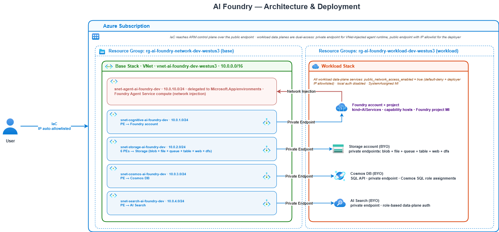

# AI Foundry Private Networking Lab

Foundry Agent Service with a **BYO stateful stack** — Storage, Cosmos DB, and AI Search stay in your subscription, wired to Foundry via managed-identity connections + capability hosts, over a fully-private VNet.

This lab follows the [Cloud Adoption Framework (CAF) landing-zone pattern](https://learn.microsoft.com/azure/cloud-adoption-framework/ready/landing-zone/design-area/network-topology-and-connectivity) for network topology: **networking / platform resources live in a dedicated networking RG**, and **workload data-plane resources live in a separate per-workload RG**. This mirrors production CAF landing zones where a central platform team owns and manages shared networking (VNets, private DNS zones, subnets), and application teams deploy their workloads cross-RG on top of it.

Two implementations of the same architecture, side-by-side:

- **Path A — Bicep** in [`base/bicep/`](base/bicep/) + [`workload/bicep/`](workload/bicep/). No state to manage; ARM tracks deployment history natively.
- **Path B — Terraform** in [`base/terraform/`](base/terraform/) + [`workload/terraform/`](workload/terraform/). Uses a remote `azurerm` backend; the state Storage Account itself is bootstrapped with `az`, then imported so Terraform manages it (including adding its Private Endpoint) from there.

Pick one path. Don't mix Path A + Path B against the same RGs — the two paths use identical naming conventions and would fight over resource names.

## Architecture



Source: [`assets/architecture.drawio`](assets/architecture.drawio) &nbsp; · &nbsp; PNG: [`assets/architecture.png`](assets/architecture.png)

The diagram shows the runtime architecture both paths provision. Path B additionally bootstraps a Terraform-state Storage Account with a blob Private Endpoint (a Terraform mechanism, not part of the deployed app), described in Path B Step 2 but omitted from the diagram.

**Base stack (both paths)** — deploys into the **networking RG** (`rg-ai-foundry-network-dev-westus3` by default):
- 1 VNet (`10.0.0.0/16`) + 5 subnets: 4 private-endpoint subnets + 1 agent subnet delegated to `Microsoft.App/environments`
- 11 private DNS zones (3 Cognitive + 6 Storage + Cosmos + Search) linked to the VNet
- No Network Security Groups (NSGs), VMs, jumpboxes, CI runners, or NAT gateways

**Base stack (Path B only)** additionally bootstraps (into the networking RG):
- A **Terraform-state Storage Account** (`sttfs<hash>`) with a blob Private Endpoint, holding a `tfstate` container that both stacks use as their remote-state backend. Path A doesn't need this — ARM tracks its own deployment history.

**Workload stack (both paths)** — deploys into the **workload RG** (`rg-ai-foundry-workload-dev-westus3` by default) and looks up base's VNet + DNS zones cross-RG:
- Foundry Account (`AIServices` kind, project management enabled, agent-subnet network injection) + Private Endpoint
- BYO Storage Account (6 PEs: blob/file/queue/table/dfs/web), Cosmos DB (SQL API + 1 PE), AI Search (standard + 1 PE)
- Foundry project + 3 Entra-ID connections + all Phase-3 / Phase-5 RBAC + account & project capability hosts
- All 4 data-plane services default to **public network access enabled** with a **default-deny** firewall + deployer-IP allowlist

Every private-endpoint-bearing service uses the same posture: local (shared-key/API-key) auth **disabled**, SystemAssigned MI, Private Endpoint from the VNet, public endpoint restricted to the deployer's IP (which you can strip in the [hardening step](#part-c--harden-remove-deployer-ip-and-close-public-endpoints)).

### DNS zones + Private Endpoints

The base stack creates **11 private DNS zones**, all VNet-linked, matching the authoritative Microsoft [Private Endpoint DNS zone table](https://learn.microsoft.com/azure/private-link/private-endpoint-dns). Base creates and VNet-links the zones **before** the workload's PEs so `privateDnsZoneGroups` auto-register the PE A-records at creation time.

| Service | Subresource / groupId | Zone (Azure public cloud) |
|---|---|---|
| Foundry Account (`Microsoft.CognitiveServices/accounts`, kind=AIServices) | `account` | `privatelink.cognitiveservices.azure.com` + `privatelink.openai.azure.com` + `privatelink.services.ai.azure.com` (all three are required for Foundry Standard Setup) |
| Storage Account (`Microsoft.Storage/storageAccounts`) | `blob` / `file` / `queue` / `table` / `dfs` / `web` | `privatelink.<subresource>.core.windows.net` (6 zones) |
| Cosmos DB (`Microsoft.DocumentDB/databaseAccounts`, SQL API) | `Sql` | `privatelink.documents.azure.com` |
| AI Search (`Microsoft.Search/searchServices`) | `searchService` | `privatelink.search.windows.net` |

> ⚠️ **Sovereign-cloud deploys (Azure Gov / China)** must override `cosmosPrivateDnsZoneName`, `searchPrivateDnsZoneName`, and (Terraform only) `storagePrivateDnsZoneNames` to their cloud-specific values — see the MS DNS zone table's Government / China sections. Bicep derives the storage suffix via `az.environment().suffixes.storage`; the other 3 zone names are hardcoded to commercial-cloud values.

> **On storage PE breadth:** all 6 storage subresource PEs are created for symmetry with Microsoft's general private-endpoint patterns. Foundry Agent Service Standard Setup itself only uses `blob` at runtime — the other 5 (~$35/month total) are belt-and-braces provisioning that lets you later use File Share, Queue-backed Function tools, ADLS Gen2, or Static Web hosting without changing the network topology. To skip the unused 5, pass empty arrays for their `*PrivateDnsZoneIds` params (Bicep) / `*_private_dns_zone_ids` variables (Terraform).

---

## Prerequisites

- **Windows PowerShell 7+** — all commands below are pwsh. **Keep one session open for the whole deploy** so shell variables persist. If you close and reopen, re-run Step 1 (both paths) and Step 2 (Path B) before continuing.
- **Azure CLI** ≥ 2.60 ([install](https://learn.microsoft.com/cli/azure/install-azure-cli)).
- **`az login` with sufficient permissions.** For a first deploy from a fresh subscription, `Owner` at subscription scope is simplest. For least-privilege, the caller needs these at the corresponding scopes — most are standard Contributor, but `Cosmos DB Operator`, `User Access Administrator` / `RBAC Admin`, and `Private DNS Zone Contributor` are special cases:

  | Permission | Where | Why |
  |---|---|---|
  | Resource creation (Contributor covers this) | Both RGs | Create/update the VNet, subnets, DNS zones, Storage, Cosmos, AI Search, Foundry Account, project, PEs, connections, capability host |
  | `Microsoft.Authorization/roleAssignments/write` (**User Access Administrator** or **Role Based Access Control Administrator**) | Workload RG | Create the 5 `Microsoft.Authorization/roleAssignments` the workload grants to the project MI on Storage / Cosmos / AI Search |
  | `Microsoft.DocumentDB/databaseAccounts/sqlRoleAssignments/write` (**Cosmos DB Operator** on the Cosmos Account, or Contributor at sub/RG scope) | Workload RG (Cosmos Account) | Create the Cosmos SQL data-plane role assignment for the project MI. This is a Cosmos-native RBAC resource, NOT `Microsoft.Authorization/roleAssignments` — **UAA and RBAC Admin do NOT include it.** |
  | `Microsoft.Network/privateDnsZones/join/action` (**Private DNS Zone Contributor** or higher) | The RG that owns the 11 private DNS zones (by default the networking RG; may be a separate central connectivity / hub RG if `dnsResourceGroupName` / `dns_resource_group_name` is overridden) | Link the 9 workload PEs' DNS zone groups to the private DNS zones that live outside the workload RG (per the [CAF split-RG topology](#deployment-topology-public-path-vs-private-path) and the [BYO base networking](#bringing-your-own-base-networking) section). Same-RG deployers skip this. |

  RP registration by itself only needs `*/register/action` (Contributor at sub scope is sufficient). Returning deployers with all existing role assignments and DNS zone group links can drop to Contributor for subsequent redeploys.
- **Terraform** ≥ 1.7.5 ([install](https://developer.hashicorp.com/terraform/install)) — Path B only.
- **Bicep CLI** ≥ 0.30 (bundled with recent `az`; run `az bicep upgrade` if needed) — Path A only.
- Outbound HTTPS to `https://api.ipify.org` from your laptop (skip if you're on the [private-path deploy](#deployment-topology-public-path-vs-private-path)).

Each deploy step below **starts with a `Set-Location` (`cd`) into the specific stack directory** — `environments/ai-foundry/base/bicep`, `environments/ai-foundry/base/terraform`, `environments/ai-foundry/workload/bicep`, or `environments/ai-foundry/workload/terraform` — and all Bicep / Terraform commands in that step use short relative paths (`main.bicep`, `.`) from there. If a command errors with `Could not find ...\main.bicep` or Terraform picks up the wrong module, check `Get-Location` — you're in the wrong directory. Sign-in / variable-setup steps and `az` verification commands don't depend on your working directory, so you can run them from anywhere.

Both paths default to region `westus3` and the CAF split-RG layout:

| Stack | Default RG name | Contents |
|---|---|---|
| Base (networking) | `rg-ai-foundry-network-dev-westus3` | VNet, subnets, private DNS zones (+ tfstate SA for Path B) |
| Workload (data plane) | `rg-ai-foundry-workload-dev-westus3` | Foundry, Storage, Cosmos, AI Search + all workload Private Endpoints |

---

## Deployment topology: public path vs private path

The workload data-plane services (Storage, Cosmos, AI Search, Foundry) all sit behind Private Endpoints, but their **public endpoints stay `Enabled` by default** with a default-deny firewall + explicit allowlist. The allowlist mostly exists for the **post-deploy** admin / SDK operations you're likely to run from the deployer's machine — opening the Foundry portal, listing Cosmos containers with `az cosmosdb sql container list`, uploading a test blob with `az storage blob upload`, running the Python Foundry SDK, etc. All of those go straight to the service's public FQDN and get blocked by the default-deny firewall unless your IP is on the allowlist.

During the deploy itself, the picture is subtler: the workload's IaC provisions resources like `Microsoft.CognitiveServices/accounts/connections`, `Microsoft.DocumentDB/databaseAccounts/sqlRoleAssignments`, and `Microsoft.CognitiveServices/accounts/projects/capabilityHosts`. These are **ARM control-plane** operations — the deployer's `az` session calls `management.azure.com`, and Azure's own RPs then talk to the target services internally (via the `bypass = AzureServices` trusted-services path that all four workload modules set). So the deploy usually succeeds even without an allowlist entry for the deployer. The IP allowlist matters most for what you'll do with the deployment afterward.

Two supported topologies. Both use the same IaC; only the value you pass for `deployerIp` (Bicep) / `deployer_ip` (Terraform) differs.

| Topology | Deployer machine is… | Post-deploy admin traffic | `deployerIp` value | Typical use |
|---|---|---|---|---|
| **Public path** (default) | On the public internet (laptop at home, unmanaged network) | Deployer → public FQDN → firewall allowlist → service | Your public IPv4 (auto-detected in Path B via `api.ipify.org`; read from `$env:DEPLOYER_IP` in Path A) | Personal / lab deploys from an unmanaged network |
| **Private path** | On a corporate network with VPN / ExpressRoute / Bastion into the workload VNet, or on an existing jump box / CI runner already in the VNet | Deployer → public FQDN → **resolves to private IP via the base stack's private DNS zones** → PE → service | `""` (empty string) — skips the allowlist entry | Corporate deploys where the laptop already has private DNS + routing, CI runners inside the VNet |

**How the private path works:** the workload service FQDNs resolve through the 11 private DNS zones the base stack VNet-links. When your deployer uses Azure-integrated DNS for those zones — directly (VM in the VNet), via your VPN client's DNS, or via an on-prem forwarder pointed at Azure's virtual server `168.63.129.16` — the FQDNs return the PE's private IP and admin traffic never hits the public endpoint.

**Which path am I on?** Use intent, not DNS parsing (client-side DNS checks miss corporate NRPT / split-tunnel VPN configs and give false answers):

1. Deploying from a jumpbox / CI runner **already inside the workload VNet** → **private path**.
2. Deploying from a laptop on **corporate VPN / ExpressRoute peered to the workload VNet**, AND your platform team has confirmed `privatelink.*` zones are forwarded to Azure DNS → **private path**.
3. Anything else (home internet, unmanaged network, unsure) → **public path**.

When unsure, default to the public path — switching to private later is a one-command redeploy with `deployerIp=""` / `-var 'deployer_ip='`. There is no reliable client-side way to prove your DNS is wired for the private path before your first deploy; the accurate verification only works post-deploy, so it lives under Path A Step 3 and Path B Step 5 as "Verify the private path."

**Once the deploy is complete you don't need `deployerIp` any longer.** The agent runtime always uses the Private Endpoints from inside the VNet. Any future deploys either need the IP re-added (public path) or need the deployer machine on the private path. See [Part C — Harden](#part-c--harden-remove-deployer-ip-and-close-public-endpoints) for the post-deploy lockdown that strips the IP and (optionally) fully closes the public endpoints.

---

> ⚠️ **Every resource in this stack must be in the SAME Azure region** — both RGs, VNet, subnets, DNS zone links, all 9 workload PEs, and the 4 data-plane services. This isn't a lab convention: a Private Endpoint must co-locate with its target service, and the Foundry Account must co-locate with its injected VNet (per [Microsoft's Foundry Agent Service private-networking docs](https://learn.microsoft.com/azure/ai-foundry/agents/how-to/virtual-networks#limitations)). The templates enforce this via a single `location` variable defaulting to `westus3`; if you change the region, change it in **both** stacks or workload PE creation fails with a region-mismatch error. Verify the target region is on Microsoft's [supported-regions list for Foundry Agent Service private networking](https://learn.microsoft.com/azure/ai-foundry/agents/concepts/limits-quotas-regions#supported-regions).

---

## Bringing your own base networking

The workload stack looks base resources up **by NAME** (Bicep `existing`, Terraform `data`) — it does NOT read the base stack's outputs or state. That means you can point the workload at ANY pre-existing VNet + subnets + private DNS zones (a shared platform VNet, an ALZ spoke, a run of `base/` with custom names, or a hand-built lab) by overriding the matching parameter / variable. Every override is optional; unset values fall back to the base stack's naming convention. Mix and match as needed.

> **VNet + subnet names have a preferred override path.** The workload deploy commands (Step 3 for Bicep, Step 5 for Terraform, plus Redeploy / C1 / C2 for each) always inject the 6 session variables `$VNET_NAME` and `$SUBNET_*` via `-p` / `-var` flags. **CLI flags win over `main.bicepparam` / `terraform.tfvars` for these 6 names** — editing those files for VNet / subnet names is silently ignored. To use different names, change the 6 session vars in Step 1 (Path A) or Step 1 (Path B) instead. Every OTHER override in the table below (RGs, DNS zone names, custom subdomain, `baseName` / `environment` / `location`) still works fine via the param / tfvars files. Note: `baseName` / `environment` / `location` in the file WON'T re-derive VNet + subnet names, because those 6 come from CLI — you'd need to update both the file AND the session vars.

| What you want to override | Bicep param | Terraform variable | Default | Where to change |
|---|---|---|---|---|
| RG that owns the VNet + subnets | `baseResourceGroupName` | `base_resource_group_name` | `rg-ai-foundry-network-dev-westus3` | `main.bicepparam` / `terraform.tfvars` |
| RG that owns the 11 private DNS zones (if separate from the VNet's RG — classic CAF connectivity / hub RG) | `dnsResourceGroupName` | `dns_resource_group_name` | reuses `baseResourceGroupName` | `main.bicepparam` / `terraform.tfvars` |
| VNet name | `vnetName` | `vnet_name` | `vnet-ai-foundry-dev-<$LOC>` | **session var `$VNET_NAME` in Step 1** |
| Cognitive-PE subnet name | `subnetNameCognitivePep` | `subnet_name_cognitive_pep` | `snet-cognitive-ai-foundry-dev` | **session var `$SUBNET_COGNITIVE_PEP` in Step 1** |
| Storage-PE subnet name | `subnetNameStoragePep` | `subnet_name_storage_pep` | `snet-storage-ai-foundry-dev` | **session var `$SUBNET_STORAGE_PEP` in Step 1** |
| Cosmos-PE subnet name | `subnetNameCosmosPep` | `subnet_name_cosmos_pep` | `snet-cosmos-ai-foundry-dev` | **session var `$SUBNET_COSMOS_PEP` in Step 1** |
| Search-PE subnet name | `subnetNameSearchPep` | `subnet_name_search_pep` | `snet-search-ai-foundry-dev` | **session var `$SUBNET_SEARCH_PEP` in Step 1** |
| Agent (delegated) subnet name | `subnetNameAgent` | `subnet_name_agent` | `snet-agent-ai-foundry-dev` | **session var `$SUBNET_AGENT` in Step 1** |
| Foundry custom subdomain (privatelink hostname prefix) | `cognitiveCustomSubdomainName` | `cognitive_custom_subdomain_name` | `cog-acc-<baseName>-<environment>-<location>` | `main.bicepparam` / `terraform.tfvars` |
| 3 Cognitive privatelink DNS zone names | `cognitivePrivateDnsZoneNames` (must be length 3) | `cognitive_private_dns_zone_names` (must be length 3) | `privatelink.{cognitiveservices,openai,services.ai}.azure.com` | `main.bicepparam` / `terraform.tfvars` |
| 6 Storage privatelink DNS zone names | `storagePrivateDnsZoneNames` (must be length 6) | `storage_private_dns_zone_names` (must be length 6) | `privatelink.{blob,file,queue,table,dfs,web}.core.windows.net` | `main.bicepparam` / `terraform.tfvars` |
| Cosmos privatelink DNS zone name | `cosmosPrivateDnsZoneName` | `cosmos_private_dns_zone_name` | `privatelink.documents.azure.com` | `main.bicepparam` / `terraform.tfvars` |
| AI Search privatelink DNS zone name | `searchPrivateDnsZoneName` | `search_private_dns_zone_name` | `privatelink.search.windows.net` | `main.bicepparam` / `terraform.tfvars` |
| Shift the whole derived-name set at once | `baseName` / `environment` / `location` | `base_name` / `environment` / `location` | `ai-foundry` / `dev` / `westus3` | `main.bicepparam` / `terraform.tfvars` |

Two starting-point files bundle these overrides as commented examples:
- **Bicep:** [`workload/bicep/main.bicepparam`](workload/bicep/main.bicepparam) has a "BRING YOUR OWN BASE NETWORKING" block with every option pre-written for you to uncomment.
- **Terraform:** [`workload/terraform/terraform.tfvars.example`](workload/terraform/terraform.tfvars.example) has the same block. Copy it to `terraform.tfvars` (git-ignored) and uncomment what you need.

Constraints that DON'T bend:
- The 5 subnets must exist on the VNet you point at, with the standard sizes (`/24` is fine) and the agent subnet delegated to `Microsoft.App/environments`.
- The 11 privatelink DNS zones must be VNet-linked to your VNet BEFORE the workload's Private Endpoints are created, so their A-records auto-register. If your platform team owns the zones, ask them to VNet-link to the target VNet first.
- Every resource stays in the same Azure region (see the region warning above).
- If the DNS zones live in a different RG than the VNet, your `az`/Terraform principal needs `Microsoft.Network/privateDnsZones/join/action` (Private DNS Zone Contributor) on THAT RG — see the least-privilege table under [Prerequisites](#prerequisites).

---

## Path A — Bicep

### Step 1. Sign in, create the RG, register Resource Providers (~3 min)

These are all `az` commands — no working-directory dependency. Run them from anywhere.

Sign in:

```powershell
az login
```

Pin the subscription:

```powershell
az account set --subscription <YOUR_SUBSCRIPTION_ID>
```

Confirm the active subscription / tenant:

```powershell
az account show --query "{Subscription:name, Id:id, Tenant:tenantId}" -o table
```

Set the target region (default `westus3`):

```powershell
$LOC = "westus3"
```

Set the base stack's RG name:

```powershell
$RG_NETWORK = "rg-ai-foundry-network-dev-$LOC"
```

Set the workload stack's RG name:

```powershell
$RG_WORKLOAD = "rg-ai-foundry-workload-dev-$LOC"
```

Set the workload naming variables that the workload deploy looks up cross-RG on base's VNet. The defaults below match the base stack's naming convention with `baseName=ai-foundry`, `environment=dev`. If you're deploying against a pre-existing VNet with different names (BYO base networking), change any of them before running the workload deploy — see [Bringing your own base networking](#bringing-your-own-base-networking). PowerShell expands `$LOC` at assignment time, so make sure `$LOC` is set BEFORE the `$VNET_NAME` block below — if you change `$LOC` later, re-run the `$VNET_NAME` assignment too.

Set the VNet name:

```powershell
$VNET_NAME = "vnet-ai-foundry-dev-$LOC"
```

Set the Cognitive-PE subnet name (Foundry Account Private Endpoint lives here):

```powershell
$SUBNET_COGNITIVE_PEP = "snet-cognitive-ai-foundry-dev"
```

Set the Storage-PE subnet name (all 6 Storage subresource Private Endpoints live here):

```powershell
$SUBNET_STORAGE_PEP = "snet-storage-ai-foundry-dev"
```

Set the Cosmos-PE subnet name:

```powershell
$SUBNET_COSMOS_PEP = "snet-cosmos-ai-foundry-dev"
```

Set the Search-PE subnet name:

```powershell
$SUBNET_SEARCH_PEP = "snet-search-ai-foundry-dev"
```

Set the agent subnet name (delegated to `Microsoft.App/environments`; Foundry Agent Service network-injects here):

```powershell
$SUBNET_AGENT = "snet-agent-ai-foundry-dev"
```

Echo them back to verify:

```powershell
Get-Variable LOC, RG_NETWORK, RG_WORKLOAD, VNET_NAME, SUBNET_COGNITIVE_PEP, SUBNET_STORAGE_PEP, SUBNET_COSMOS_PEP, SUBNET_SEARCH_PEP, SUBNET_AGENT | Format-Table -AutoSize Name, Value
```

Create the networking RG:

```powershell
az group create -n $RG_NETWORK  -l $LOC --tags environment=dev workload=ai-foundry stack=network
```

Create the workload RG:

```powershell
az group create -n $RG_WORKLOAD -l $LOC --tags environment=dev workload=ai-foundry stack=workload
```

Verify both RGs are `Succeeded`:

```powershell
az group list --query "[?name=='$RG_NETWORK' || name=='$RG_WORKLOAD'].{Name:name, Location:location, State:properties.provisioningState}" -o table
```

Expected: both rows show `Succeeded` in the `State` column.

Register the 6 Resource Providers this stack needs (this block is one command — the `foreach` loop):

```powershell
foreach ($rp in @(
    # NOTE: if you add/remove an RP here, also update the verify query below AND the mirror
    # list in Path B Step 1's register block + verify query -- 4 places total.
    'Microsoft.App',                # required by the agent subnet's Microsoft.App/environments delegation (Foundry Agent Service runtime)
    'Microsoft.CognitiveServices',  # Foundry account + project + connections + capability hosts
    'Microsoft.DocumentDB',         # Cosmos DB
    'Microsoft.Network',            # VNet, subnets, private DNS zones, private endpoints
    'Microsoft.Search',             # AI Search
    'Microsoft.Storage'             # Storage account
)) { az provider register --namespace $rp --wait }
```

Verify every RP shows `Registered` (keep this list in sync with the registration block above):

```powershell
az provider list --query "[?contains(['Microsoft.App','Microsoft.CognitiveServices','Microsoft.DocumentDB','Microsoft.Network','Microsoft.Search','Microsoft.Storage'], namespace)].{Namespace:namespace, State:registrationState}" -o table
```

Expected: every row shows `Registered`.

### Step 2. Deploy the base stack (~4 min)

Base creates the VNet + 5 subnets + 11 private DNS zones with VNet links, **into the networking RG (`$RG_NETWORK`)**. No IP allowlisting needed — none of these are firewalled services.

`cd` into the base Bicep directory:

```powershell
Set-Location (Join-Path (git rev-parse --show-toplevel) 'environments/ai-foundry/base/bicep')
```

Verify:

```powershell
Get-Location   # expect: ...\environments\ai-foundry\base\bicep
```

Deploy:

```powershell
az deployment group create `
    -g $RG_NETWORK `
    -n base-$(Get-Date -Format 'yyyyMMdd-HHmmss') `
    -f main.bicep `
    -p main.bicepparam
```

Verify:

```powershell
az resource list -g $RG_NETWORK --query "[?type=='Microsoft.Network/virtualNetworks' || type=='Microsoft.Network/privateDnsZones'].{Name:name, Type:type}" -o table
az network nsg list -g $RG_NETWORK --query "[].name" -o tsv
az network nsg list -g $RG_WORKLOAD --query "[].name" -o tsv
```

Expected: 1 VNet (`vnet-ai-foundry-dev-westus3`) + 11 privateDnsZones, followed by no NSG output from either RG.

### Step 3. Deploy the workload stack (~15–20 min)

The workload deploys **into `$RG_WORKLOAD`** and by default looks up base's VNet + subnets + 11 private DNS zones cross-RG in `$RG_NETWORK` (the `baseResourceGroupName` param in `main.bicep` defaults to `rg-ai-foundry-network-dev-westus3`). If the DNS zones live in a separate central connectivity / hub RG, override `dnsResourceGroupName` too — see [Bringing your own base networking](#bringing-your-own-base-networking).

> **Resuming from an existing base deploy?** If you're in a new terminal session (variables gone) or the base was deployed by someone else / a prior CI run, you need to re-set the session variables before running the deploy — the RG names AND the workload naming vars (VNet + 5 subnets) both feed the deploy command below.
>
> Set the region (the region the base stack was deployed in):
>
> ```powershell
> $LOC = "westus3"
> ```
>
> Set the RG the base stack lives in:
>
> ```powershell
> $RG_NETWORK = "rg-ai-foundry-network-dev-$LOC"
> ```
>
> Set the RG the workload deploys into (create it below if missing):
>
> ```powershell
> $RG_WORKLOAD = "rg-ai-foundry-workload-dev-$LOC"
> ```
>
> Re-set the 6 workload naming vars (defaults match the base stack's convention; change any that don't match your actual base deploy — see the [BYO section](#bringing-your-own-base-networking)). PowerShell expands `$LOC` at assignment time, so `$LOC` must already be set (from the block above) before the `$VNET_NAME` line runs; if you change `$LOC` later, re-run the `$VNET_NAME` assignment too:
>
> ```powershell
> $VNET_NAME = "vnet-ai-foundry-dev-$LOC"
> ```
>
> ```powershell
> $SUBNET_COGNITIVE_PEP = "snet-cognitive-ai-foundry-dev"
> ```
>
> ```powershell
> $SUBNET_STORAGE_PEP = "snet-storage-ai-foundry-dev"
> ```
>
> ```powershell
> $SUBNET_COSMOS_PEP = "snet-cosmos-ai-foundry-dev"
> ```
>
> ```powershell
> $SUBNET_SEARCH_PEP = "snet-search-ai-foundry-dev"
> ```
>
> ```powershell
> $SUBNET_AGENT = "snet-agent-ai-foundry-dev"
> ```
>
> Make sure `$RG_WORKLOAD` exists (Path A Step 1 creates it — skip if you already ran it):
>
> ```powershell
> az group create -n $RG_WORKLOAD -l $LOC --tags environment=dev workload=ai-foundry stack=workload
> ```
>
> **If the base stack was deployed with non-default names / values**, first discover what's actually in `$RG_NETWORK`. List the VNet and DNS zones:
>
> ```powershell
> az resource list -g $RG_NETWORK --query "[?type=='Microsoft.Network/virtualNetworks' || type=='Microsoft.Network/privateDnsZones'].{Name:name, Type:type}" -o table
> ```
>
> Then list the subnets on the VNet you found:
>
> ```powershell
> az network vnet subnet list -g $RG_NETWORK --vnet-name <your-vnet-name> --query "[].name" -o tsv
> ```
>
> Then either:
> - **Edit** [`main.bicepparam`](workload/bicep/main.bicepparam) directly — it has commented examples for every override EXCEPT the 6 CLI-pinned names (`baseName`, `environment`, `location`, `baseResourceGroupName`, `dnsResourceGroupName`, DNS zone names, `cognitiveCustomSubdomainName`, etc.). VNet + subnet names must be changed via the 6 session vars (`$VNET_NAME`, `$SUBNET_*`) in Step 1 above; editing those in `main.bicepparam` is silently ignored because Step 3's deploy passes CLI `-p` flags for them.
> - **Pass overrides on the CLI** via `-p` flags on the `az deployment group create` below — e.g. `-p baseResourceGroupName=<rg-name>`, `-p baseName=<value>`. VNet + subnet names should go through the 6 session vars, NOT an ad-hoc `-p vnetName=<name>` (the deploy command already carries `-p "vnetName=$VNET_NAME"`).
>
> The most common overrides:
> - `-p baseResourceGroupName=<rg>` — if base lives in an RG that doesn't match the default `rg-ai-foundry-network-dev-<loc>`
> - `-p dnsResourceGroupName=<rg>` — if the 11 private DNS zones live in a different RG from the VNet (classic CAF: DNS zones consolidated in a central connectivity / hub RG). Blank = reuse `baseResourceGroupName`.
> - **VNet + subnet names** — change the 6 session vars (`$VNET_NAME`, `$SUBNET_COGNITIVE_PEP`, `$SUBNET_STORAGE_PEP`, `$SUBNET_COSMOS_PEP`, `$SUBNET_SEARCH_PEP`, `$SUBNET_AGENT`) in Step 1, NOT the corresponding `main.bicepparam` entries. The Step 3 deploy always passes them as `-p` flags, so CLI overrides win over `main.bicepparam` — file edits to these 6 names are silently ignored.
> - `-p baseName=<v> -p environment=<v> -p location=<v>` — shifts derived names for the Foundry Account subdomain (`cog-acc-<baseName>-<environment>-<location>`) and the account resource itself. It does NOT re-derive the VNet + subnet names, because those come from the 6 session vars — update the session vars separately if you're changing `baseName` / `environment` / `location`.

`cd` into the workload Bicep directory:

```powershell
Set-Location (Join-Path (git rev-parse --show-toplevel) 'environments/ai-foundry/workload/bicep')
```

Verify:

```powershell
Get-Location   # expect: ...\environments\ai-foundry\workload\bicep
```

Set your public IP as an environment variable (Bicep's `main.bicepparam` reads it via `readEnvironmentVariable('DEPLOYER_IP', '')`). See [Deployment topology](#deployment-topology-public-path-vs-private-path) for how to choose — both are valid; pick one:

**Option A — public-path deploy (default).** Laptop on the public internet. Grab your public IP so the workload firewalls allow your `az` session:

```powershell
$env:DEPLOYER_IP = (Invoke-RestMethod https://api.ipify.org).Trim()
```

Echo to verify:

```powershell
Write-Host "DEPLOYER_IP = $env:DEPLOYER_IP"
```

**Option B — private-path deploy.** Deployer on VPN / ExpressRoute / Bastion / VNet-injected runner. The workload FQDNs resolve to private IPs via the base stack's private DNS zones, so no allowlist entry is needed:

```powershell
$env:DEPLOYER_IP = ""
```

Deploy:

```powershell
az deployment group create `
    -g $RG_WORKLOAD `
    -n workload-$(Get-Date -Format 'yyyyMMdd-HHmmss') `
    -f main.bicep `
    -p main.bicepparam `
    -p "vnetName=$VNET_NAME" `
    -p "subnetNameCognitivePep=$SUBNET_COGNITIVE_PEP" `
    -p "subnetNameStoragePep=$SUBNET_STORAGE_PEP" `
    -p "subnetNameCosmosPep=$SUBNET_COSMOS_PEP" `
    -p "subnetNameSearchPep=$SUBNET_SEARCH_PEP" `
    -p "subnetNameAgent=$SUBNET_AGENT"
```

Verify the 4 data-plane services and the 9 workload PEs (all in `$RG_WORKLOAD`). List the four data-plane services:

```powershell
az resource list -g $RG_WORKLOAD --query "[?type=='Microsoft.CognitiveServices/accounts' || type=='Microsoft.Storage/storageAccounts' || type=='Microsoft.DocumentDB/databaseAccounts' || type=='Microsoft.Search/searchServices'].{Name:name, Type:type}" -o table
```

Count the Private Endpoints:

```powershell
(az resource list -g $RG_WORKLOAD --resource-type Microsoft.Network/privateEndpoints -o json | ConvertFrom-Json).Count
```

Expected: 1 Foundry Account + 1 Storage + 1 Cosmos + 1 Search; PE count = **9** (1 Foundry + 6 Storage subresources + 1 Cosmos + 1 Search).

→ **Public-path deploys should now run [Part C1](#part-c1--strip-deployer-ip-and-any-extra-allowlisted-ips-public-path-only)** to strip the deployer IP + `allowedIpsExtra` off every workload firewall so those IPs don't linger. [Part C2](#part-c2--optionally-disable-public-endpoints-entirely-zero-trust) then optionally closes the public endpoints entirely.

**Verify the private path** (only if you chose Option B above). Resolve the Foundry Account's FQDN; a `10.x.x.x` address means DNS routed through the base stack's private zones and admin traffic is on the private path. A public IP means the DNS didn't integrate — either allowlist your IP + redeploy (public path), or fix your DNS routing (e.g. add a conditional forwarder / peer the VPN's DNS to Azure DNS) and rerun this verify.

Grab the Foundry FQDN:

```powershell
$foundryFqdn = (az cognitiveservices account list -g $RG_WORKLOAD --query "[?kind=='AIServices'].properties.endpoint | [0]" -o tsv) -replace 'https://', '' -replace '/$', ''
```

Resolve it:

```powershell
Resolve-DnsName $foundryFqdn | Select-Object Name, IPAddress
```

Why the IP is on the allowlist by default: the deploy itself is mostly ARM control-plane (the Cognitive Services / Cosmos / Search / Storage RPs do their work internally via the `bypass = AzureServices` trusted-services path), but the allowlist entry means your `az` / Portal / SDK admin operations from this same machine keep working **after** the deploy without further changes. On the private path (see [Deployment topology](#deployment-topology-public-path-vs-private-path)) that admin traffic goes through Private Endpoints instead, and no allowlist entry is needed.

### Step 4. Full inventory (across both RGs)

List everything in the networking RG:

```powershell
az resource list -g $RG_NETWORK  --query "sort_by([], &type)[].{Name:name, Type:type}" -o table
```

List everything in the workload RG:

```powershell
az resource list -g $RG_WORKLOAD --query "sort_by([], &type)[].{Name:name, Type:type}" -o table
```

Expected:
- `$RG_NETWORK`: 1 VNet, 5 subnets, 11 privateDnsZones
- `$RG_WORKLOAD`: 9 privateEndpoints, 1 Foundry Account + 1 project, 1 Storage, 1 Cosmos, 1 Search

---

## Path B — Terraform

Terraform can't atomically create its own backing store, so the flow has one extra step at the top: **bootstrap the state Storage Account with `az`**, then `terraform import` it and let Terraform manage it (including adding its Private Endpoint) from there.

### Step 1. Sign in, create the RG, register Resource Providers, grant blob data access (~3 min)

These are all `az` commands — no working-directory dependency. Run them from anywhere.

Sign in:

```powershell
az login
```

Pin the subscription:

```powershell
az account set --subscription <YOUR_SUBSCRIPTION_ID>
```

Set the target region (default `westus3`):

```powershell
$LOC = "westus3"
```

Set the networking RG name (base stack + tfstate SA live here):

```powershell
$RG_NETWORK = "rg-ai-foundry-network-dev-$LOC"
```

Set the workload RG name:

```powershell
$RG_WORKLOAD = "rg-ai-foundry-workload-dev-$LOC"
```

Set the workload naming variables that the workload deploy looks up cross-RG on base's VNet. The defaults below match the base stack's naming convention with `base_name=ai-foundry`, `environment=dev`. If you're deploying against a pre-existing VNet with different names (BYO base networking), change any of them before running the workload deploy — see [Bringing your own base networking](#bringing-your-own-base-networking). PowerShell expands `$LOC` at assignment time, so make sure `$LOC` is set BEFORE the `$VNET_NAME` block below — if you change `$LOC` later, re-run the `$VNET_NAME` assignment too.

Set the VNet name:

```powershell
$VNET_NAME = "vnet-ai-foundry-dev-$LOC"
```

Set the Cognitive-PE subnet name (Foundry Account Private Endpoint lives here):

```powershell
$SUBNET_COGNITIVE_PEP = "snet-cognitive-ai-foundry-dev"
```

Set the Storage-PE subnet name (all 6 Storage subresource Private Endpoints live here):

```powershell
$SUBNET_STORAGE_PEP = "snet-storage-ai-foundry-dev"
```

Set the Cosmos-PE subnet name:

```powershell
$SUBNET_COSMOS_PEP = "snet-cosmos-ai-foundry-dev"
```

Set the Search-PE subnet name:

```powershell
$SUBNET_SEARCH_PEP = "snet-search-ai-foundry-dev"
```

Set the agent subnet name (delegated to `Microsoft.App/environments`; Foundry Agent Service network-injects here):

```powershell
$SUBNET_AGENT = "snet-agent-ai-foundry-dev"
```

Capture the current subscription ID:

```powershell
$SUB = (az account show --query id -o tsv)
```

Capture your Entra object ID:

```powershell
$ME = (az ad signed-in-user show --query id -o tsv)
```

Echo them back to verify:

```powershell
Get-Variable LOC, RG_NETWORK, RG_WORKLOAD, VNET_NAME, SUBNET_COGNITIVE_PEP, SUBNET_STORAGE_PEP, SUBNET_COSMOS_PEP, SUBNET_SEARCH_PEP, SUBNET_AGENT, SUB, ME | Format-Table -AutoSize Name, Value
```

Expected: all values non-empty; `SUB` looks like a GUID, `ME` looks like a GUID.

Create the networking RG:

```powershell
az group create -n $RG_NETWORK  -l $LOC --tags environment=dev workload=ai-foundry stack=network
```

Create the workload RG:

```powershell
az group create -n $RG_WORKLOAD -l $LOC --tags environment=dev workload=ai-foundry stack=workload
```

Verify both RGs are `Succeeded`:

```powershell
az group list --query "[?name=='$RG_NETWORK' || name=='$RG_WORKLOAD'].{Name:name, Location:location, State:properties.provisioningState}" -o table
```

Register the 6 Resource Providers (Terraform's `resource_provider_registrations = "none"` means Terraform will NOT auto-register, so this is required):

```powershell
foreach ($rp in @(
    # NOTE: if you add/remove an RP here, also update the verify query below AND the mirror
    # list in Path A Step 1's register block + verify query -- 4 places total.
    'Microsoft.App',                # required by the agent subnet's Microsoft.App/environments delegation (Foundry Agent Service runtime)
    'Microsoft.CognitiveServices',  # Foundry account + project + connections + capability hosts
    'Microsoft.DocumentDB',         # Cosmos DB
    'Microsoft.Network',            # VNet, subnets, private DNS zones, private endpoints
    'Microsoft.Search',             # AI Search
    'Microsoft.Storage'             # Storage account (also backs the tfstate SA bootstrapped in Step 2)
)) { az provider register --namespace $rp --wait }
```

Verify every RP shows `Registered` (keep this list in sync with the registration block above):

```powershell
az provider list --query "[?contains(['Microsoft.App','Microsoft.CognitiveServices','Microsoft.DocumentDB','Microsoft.Network','Microsoft.Search','Microsoft.Storage'], namespace)].{Namespace:namespace, State:registrationState}" -o table
```

Expected: every row shows `Registered`.

Grant yourself `Storage Blob Data Contributor` at the **networking RG** scope (that's where the tfstate SA will live) so `az storage container create --auth-mode login` and Terraform's `azurerm` backend can both authenticate via Entra ID (shared-key access is disabled on the state SA):

```powershell
az role assignment create `
    --assignee-object-id $ME `
    --assignee-principal-type User `
    --role "Storage Blob Data Contributor" `
    --scope "/subscriptions/$SUB/resourceGroups/$RG_NETWORK"
```

Wait for the role assignment to propagate before using it:

```powershell
Start-Sleep -Seconds 60
```

Verify the assignment:

```powershell
az role assignment list --assignee $ME --scope "/subscriptions/$SUB/resourceGroups/$RG_NETWORK" --query "[?roleDefinitionName=='Storage Blob Data Contributor'].{Role:roleDefinitionName, Scope:scope}" -o table
```

Expected: one row with `Storage Blob Data Contributor` at the `$RG_NETWORK` scope.

### Step 2. Bootstrap the Terraform-state Storage Account (~2 min)

The tfstate SA lives in the **networking RG** (`$RG_NETWORK`) — it's part of the base / platform stack's lifecycle. Detect your IP and derive the state SA name (`sttfs<md5(RG + base_name + environment + location)>` truncated to 12 hex chars — must match what base's `main.tf` will compute).

Grab your public IP:

```powershell
$DEPLOYER_IP = (Invoke-RestMethod https://api.ipify.org).Trim()
```

Set `$BASE_NAME` (must match `base_name` default in `variables.tf`):

```powershell
$BASE_NAME = "ai-foundry"
```

Set `$ENVIRONMENT` (must match `environment` default in `variables.tf`):

```powershell
$ENVIRONMENT = "dev"
```

Compute the state SA name (this one-liner mirrors the `md5(RG + base_name + environment + location)` hash base's `main.tf` computes, so both stacks agree on the name):

```powershell
$STATE_SA = "sttfs" + ([BitConverter]::ToString([System.Security.Cryptography.MD5]::Create().ComputeHash([System.Text.Encoding]::UTF8.GetBytes("${RG_NETWORK}${BASE_NAME}${ENVIRONMENT}${LOC}"))).Replace('-','').ToLower().Substring(0,12))
```

Echo to verify:

```powershell
Get-Variable DEPLOYER_IP, STATE_SA | Format-Table -AutoSize Name, Value
```

Expected: `DEPLOYER_IP` is a public IPv4; `STATE_SA` is 17 chars starting with `sttfs`.

Create the Storage Account in `$RG_NETWORK`:

```powershell
az storage account create `
    -g $RG_NETWORK -n $STATE_SA -l $LOC `
    --sku Standard_LRS `
    --kind StorageV2 `
    --min-tls-version TLS1_2 `
    --https-only true `
    --allow-blob-public-access false `
    --allow-shared-key-access false `
    --default-action Deny `
    --public-network-access Enabled `
    --bypass AzureServices `
    --ip-address $DEPLOYER_IP
```

Verify it landed with the expected properties:

```powershell
az storage account show -g $RG_NETWORK -n $STATE_SA --query "{Name:name, SKU:sku.name, PublicNetwork:publicNetworkAccess, TLS:minimumTlsVersion, SharedKey:allowSharedKeyAccess}" -o table
```

Expected: `SKU = Standard_LRS`, `TLS = TLS1_2`, `SharedKey = False`.

> **If this returns `StorageAccountAlreadyTaken`** (the derived `sttfs<hash>` name collides globally), pick a unique name and use it for the remainder of Path B — including `terraform init`, the `terraform import` commands, and the `-var 'tfstate_storage_account_name=...'` you'll pass to `terraform apply`:
> ```powershell
> $STATE_SA = "sttfs<something-unique>"   # then rerun the `az storage account create` above
> ```

Create the `tfstate` container:

```powershell
az storage container create `
    --auth-mode login `
    --account-name $STATE_SA `
    -n tfstate
```

Verify:

```powershell
az storage container list --auth-mode login --account-name $STATE_SA --query "[].{Name:name, PublicAccess:publicAccess}" -o table
```

Expected: `tfstate` container present with `PublicAccess = None`.

### Step 3. Init base with the remote backend + import the bootstrapped SA (~2 min)

`cd` into the base Terraform directory — everything in Steps 3 and 4 runs from here:

```powershell
Set-Location (Join-Path (git rev-parse --show-toplevel) 'environments/ai-foundry/base/terraform')
```

Verify:

```powershell
Get-Location   # expect: ...\environments\ai-foundry\base\terraform
```

Init:

```powershell
terraform init `
    -backend-config="resource_group_name=$RG_NETWORK" `
    -backend-config="storage_account_name=$STATE_SA"
```

Expected: `Terraform has been successfully initialized!`

Import the Storage Account so Terraform manages it going forward:

```powershell
terraform import `
    "module.tfstate_storage.azurerm_storage_account.this" `
    "/subscriptions/$SUB/resourceGroups/$RG_NETWORK/providers/Microsoft.Storage/storageAccounts/$STATE_SA"
```

Import the tfstate container:

```powershell
terraform import `
    "azurerm_storage_container.tfstate" `
    "/subscriptions/$SUB/resourceGroups/$RG_NETWORK/providers/Microsoft.Storage/storageAccounts/$STATE_SA/blobServices/default/containers/tfstate"
```

Verify both imports landed in state:

```powershell
terraform state list
```

Expected: at minimum `azurerm_storage_container.tfstate` and `module.tfstate_storage.azurerm_storage_account.this` present in the list.

### Step 4. Apply base (~5 min)

Still in `environments/ai-foundry/base/terraform` from Step 3. If you overrode `$STATE_SA` from the default, pass it as a variable — otherwise omit the `-var` flag:

```powershell
terraform apply `
    -var "tfstate_storage_account_name=$STATE_SA"
```

Terraform reconciles the imported state SA (adds its blob PE, applies blob-service properties: 30-day soft delete + versioning + last-access tracking), then creates the VNet + 5 subnets + 11 DNS zones with VNet links — all in `$RG_NETWORK`.

> **Upgrading an older AI Foundry deployment:** early versions also created jumpbox and CI-runner modules with NSGs. The current configuration explicitly removes both historical modules; review the destroy actions in the plan and apply them to clean those resources from Azure and Terraform state.

Verify:

```powershell
az resource list -g $RG_NETWORK --query "[?type=='Microsoft.Network/virtualNetworks' || type=='Microsoft.Network/privateDnsZones' || type=='Microsoft.Network/privateEndpoints'].{Name:name, Type:type}" -o table
az network nsg list -g $RG_NETWORK --query "[].name" -o tsv
az network nsg list -g $RG_WORKLOAD --query "[].name" -o tsv
```

Expected: 1 VNet, 11 privateDnsZones, **1 privateEndpoint** (on the state SA), followed by no NSG output from either RG.

### Step 5. Init workload with remote backend + apply (~15–20 min)

The workload deploys **into `$RG_WORKLOAD`** and by default looks up base's VNet + subnets + 11 private DNS zones cross-RG in `$RG_NETWORK` (`variables.tf`'s `resource_group_name` defaults to `rg-ai-foundry-workload-dev-westus3` and `base_resource_group_name` defaults to `rg-ai-foundry-network-dev-westus3`). If the DNS zones live in a separate central connectivity / hub RG, override `dns_resource_group_name` too — see [Bringing your own base networking](#bringing-your-own-base-networking).

> **Resuming from an existing base deploy?** If you're in a new terminal session (variables gone) or the base was deployed by someone else / a prior CI run, you need at minimum these session variables before running init + apply.
>
> Set the region (the region the base stack was deployed in):
>
> ```powershell
> $LOC = "westus3"
> ```
>
> Set the RG the base stack + tfstate SA live in:
>
> ```powershell
> $RG_NETWORK = "rg-ai-foundry-network-dev-$LOC"
> ```
>
> Set the RG the workload deploys into (create it below if missing):
>
> ```powershell
> $RG_WORKLOAD = "rg-ai-foundry-workload-dev-$LOC"
> ```
>
> Re-set the 6 workload naming vars (defaults match the base stack's convention; change any that don't match your actual base deploy — see the [BYO section](#bringing-your-own-base-networking)). PowerShell expands `$LOC` at assignment time, so `$LOC` must already be set (from the block above) before the `$VNET_NAME` line runs; if you change `$LOC` later, re-run the `$VNET_NAME` assignment too:
>
> ```powershell
> $VNET_NAME = "vnet-ai-foundry-dev-$LOC"
> ```
>
> ```powershell
> $SUBNET_COGNITIVE_PEP = "snet-cognitive-ai-foundry-dev"
> ```
>
> ```powershell
> $SUBNET_STORAGE_PEP = "snet-storage-ai-foundry-dev"
> ```
>
> ```powershell
> $SUBNET_COSMOS_PEP = "snet-cosmos-ai-foundry-dev"
> ```
>
> ```powershell
> $SUBNET_SEARCH_PEP = "snet-search-ai-foundry-dev"
> ```
>
> ```powershell
> $SUBNET_AGENT = "snet-agent-ai-foundry-dev"
> ```
>
> The tfstate SA name lives in `$RG_NETWORK`. If you don't remember it, discover it directly (safer than recomputing the hash):
>
> ```powershell
> $STATE_SA = (az storage account list -g $RG_NETWORK --query "[?starts_with(name, 'sttfs')].name | [0]" -o tsv)
> ```
>
> Echo to verify:
>
> ```powershell
> Write-Host "STATE_SA = $STATE_SA"
> ```
>
> Make sure `$RG_WORKLOAD` exists (Path B Step 1 creates it — skip if you already ran it):
>
> ```powershell
> az group create -n $RG_WORKLOAD -l $LOC --tags environment=dev workload=ai-foundry stack=workload
> ```
>
> **If the base stack was deployed with non-default names / values**, first discover what's actually in `$RG_NETWORK`:
>
> ```powershell
> az resource list -g $RG_NETWORK --query "[?type=='Microsoft.Network/virtualNetworks' || type=='Microsoft.Network/privateDnsZones'].{Name:name, Type:type}" -o table
> ```
>
> Then copy [`terraform.tfvars.example`](workload/terraform/terraform.tfvars.example) to `terraform.tfvars` (git-ignored) inside `environments/ai-foundry/workload/terraform/` and uncomment the overrides you need. This one-liner works from any cwd:
>
> ```powershell
> Copy-Item (Join-Path (git rev-parse --show-toplevel) 'environments/ai-foundry/workload/terraform/terraform.tfvars.example') (Join-Path (git rev-parse --show-toplevel) 'environments/ai-foundry/workload/terraform/terraform.tfvars')
> ```
>
> The most common overrides:
> - `resource_group_name` — workload RG (if not `rg-ai-foundry-workload-dev-<loc>`)
> - `base_resource_group_name` — where base's VNet + subnets live (if not `rg-ai-foundry-network-dev-<loc>`)
> - `dns_resource_group_name` — where the 11 private DNS zones live (if separate from the VNet's RG, i.e. classic CAF: zones consolidated in a central connectivity / hub RG). Leave null to reuse `base_resource_group_name`.
> - **VNet + subnet names** — change the 6 session vars (`$VNET_NAME`, `$SUBNET_COGNITIVE_PEP`, `$SUBNET_STORAGE_PEP`, `$SUBNET_COSMOS_PEP`, `$SUBNET_SEARCH_PEP`, `$SUBNET_AGENT`) in Step 1, NOT the corresponding `terraform.tfvars` entries. The Step 5 apply always passes them as `-var` flags, so CLI overrides win over `terraform.tfvars` — file edits to these 6 names are silently ignored.
> - `base_name` / `environment` / `location` — shifts derived names for the Foundry Account subdomain (`cog-acc-<base_name>-<environment>-<location>`) and the account resource itself. It does NOT re-derive the VNet + subnet names, because those come from the 6 session vars — update the session vars separately if you're changing `base_name` / `environment` / `location`.

`cd` into the workload Terraform directory:

```powershell
Set-Location (Join-Path (git rev-parse --show-toplevel) 'environments/ai-foundry/workload/terraform')
```

Verify:

```powershell
Get-Location   # expect: ...\environments\ai-foundry\workload\terraform
```

Init points at the same tfstate SA (in `$RG_NETWORK`) as base, but with a different blob key (`workload.tfstate`):

```powershell
terraform init `
    -backend-config="resource_group_name=$RG_NETWORK" `
    -backend-config="storage_account_name=$STATE_SA"
```

Apply. See [Deployment topology](#deployment-topology-public-path-vs-private-path) for how to choose — both are valid; pick one:

**Option A — public-path deploy (default).** Deployer on the public internet. Terraform's `data.http.myip` auto-detects your public IP and pins it into the workload firewalls:

```powershell
terraform apply `
    -var "vnet_name=$VNET_NAME" `
    -var "subnet_name_cognitive_pep=$SUBNET_COGNITIVE_PEP" `
    -var "subnet_name_storage_pep=$SUBNET_STORAGE_PEP" `
    -var "subnet_name_cosmos_pep=$SUBNET_COSMOS_PEP" `
    -var "subnet_name_search_pep=$SUBNET_SEARCH_PEP" `
    -var "subnet_name_agent=$SUBNET_AGENT"
```

**Option B — private-path deploy.** Deployer on VPN / ExpressRoute / Bastion / VNet-injected runner. Skip the ipify call entirely by pinning `deployer_ip` to empty string; the workload FQDNs resolve to private IPs via the base stack's private DNS zones, so no allowlist entry is needed:

```powershell
terraform apply `
    -var 'deployer_ip=' `
    -var "vnet_name=$VNET_NAME" `
    -var "subnet_name_cognitive_pep=$SUBNET_COGNITIVE_PEP" `
    -var "subnet_name_storage_pep=$SUBNET_STORAGE_PEP" `
    -var "subnet_name_cosmos_pep=$SUBNET_COSMOS_PEP" `
    -var "subnet_name_search_pep=$SUBNET_SEARCH_PEP" `
    -var "subnet_name_agent=$SUBNET_AGENT"
```

**Verify the private path** (only if you chose Option B). Resolve the Foundry Account's FQDN; a `10.x.x.x` address means DNS routed through the base stack's private zones. A public IP means fix your DNS routing (or drop back to the public path).

Grab the Foundry FQDN:

```powershell
$foundryFqdn = (az cognitiveservices account list -g $RG_WORKLOAD --query "[?kind=='AIServices'].properties.endpoint | [0]" -o tsv) -replace 'https://', '' -replace '/$', ''
```

Resolve it:

```powershell
Resolve-DnsName $foundryFqdn | Select-Object Name, IPAddress
```

→ **Public-path deploys should now run [Part C1](#part-c1--strip-deployer-ip-and-any-extra-allowlisted-ips-public-path-only)** to strip the deployer IP + `allowed_ips_extra` off every workload firewall so those IPs don't linger. [Part C2](#part-c2--optionally-disable-public-endpoints-entirely-zero-trust) then optionally closes the public endpoints entirely.

### Step 6. Full inventory (across both RGs)

List everything in the networking RG:

```powershell
az resource list -g $RG_NETWORK  --query "sort_by([], &type)[].{Name:name, Type:type}" -o table
```

List everything in the workload RG:

```powershell
az resource list -g $RG_WORKLOAD --query "sort_by([], &type)[].{Name:name, Type:type}" -o table
```

Expected:
- `$RG_NETWORK`: 1 VNet, 5 subnets, 11 privateDnsZones, 1 privateEndpoint (on the state SA), 1 Storage Account (the state SA itself)
- `$RG_WORKLOAD`: 9 privateEndpoints, 1 Foundry Account + 1 project, 1 Storage, 1 Cosmos, 1 Search

---

## Redeploy

Both paths are idempotent — rerun the deploy commands to pick up any change (config edit, code change, or your IP moved because you reconnected the VPN). The IaC reconciles firewall allowlists automatically.

> **If you're in a new terminal session, redefine variables first** — re-run Step 1 for both paths, plus Step 2's `$STATE_SA` derivation for Path B.

### Path A — Bicep

`cd` into the workload Bicep directory:

```powershell
Set-Location (Join-Path (git rev-parse --show-toplevel) 'environments/ai-foundry/workload/bicep')
```

Refresh your public IP into `$env:DEPLOYER_IP`:

```powershell
$env:DEPLOYER_IP = (Invoke-RestMethod https://api.ipify.org).Trim()
```

Deploy:

```powershell
az deployment group create `
    -g $RG_WORKLOAD `
    -n workload-$(Get-Date -Format 'yyyyMMdd-HHmmss') `
    -f main.bicep `
    -p main.bicepparam `
    -p "vnetName=$VNET_NAME" `
    -p "subnetNameCognitivePep=$SUBNET_COGNITIVE_PEP" `
    -p "subnetNameStoragePep=$SUBNET_STORAGE_PEP" `
    -p "subnetNameCosmosPep=$SUBNET_COSMOS_PEP" `
    -p "subnetNameSearchPep=$SUBNET_SEARCH_PEP" `
    -p "subnetNameAgent=$SUBNET_AGENT"
```

### Path B — Terraform

If your IP changed since the last apply, refresh the state SA's firewall allowlist first (Storage's control plane is always reachable regardless of the data-plane firewall — that's how this ad-hoc rule gets added). The state SA lives in `$RG_NETWORK`.

Refresh your public IP:

```powershell
$DEPLOYER_IP = (Invoke-RestMethod https://api.ipify.org).Trim()
```

Add it to the state SA firewall:

```powershell
az storage account network-rule add -g $RG_NETWORK -n $STATE_SA --ip-address $DEPLOYER_IP
```

`cd` into the workload Terraform directory:

```powershell
Set-Location (Join-Path (git rev-parse --show-toplevel) 'environments/ai-foundry/workload/terraform')
```

Apply:

```powershell
terraform apply `
    -var "vnet_name=$VNET_NAME" `
    -var "subnet_name_cognitive_pep=$SUBNET_COGNITIVE_PEP" `
    -var "subnet_name_storage_pep=$SUBNET_STORAGE_PEP" `
    -var "subnet_name_cosmos_pep=$SUBNET_COSMOS_PEP" `
    -var "subnet_name_search_pep=$SUBNET_SEARCH_PEP" `
    -var "subnet_name_agent=$SUBNET_AGENT"
```

The ad-hoc network-rule stays as drift on the state SA until the next `base` apply, at which point `data.http.myip` reconciles the full allowlist canonically.

---

## Part C — Harden: remove deployer IP and close public endpoints

Once the deploy is verified, lock the workload data planes down. Two sub-parts — do them in order:

1. **[Part C1](#part-c1--strip-deployer-ip-and-any-extra-allowlisted-ips-public-path-only)** — strip **every** allowlisted IP off the 4 workload firewalls (deployer IP + `allowedIpsExtra`). Recommended immediately after every public-path deploy so your IP doesn't linger. Public endpoints stay enabled with a default-deny firewall + empty allowlist; the agent runtime keeps working over Private Endpoints, and Azure trusted services keep working over the `bypass = AzureServices` path.
2. **[Part C2](#part-c2--optionally-disable-public-endpoints-entirely-zero-trust)** — optionally close the public endpoints entirely. Blocks the trusted-services bypass path too. Skip if you plan to redeploy soon (you'll re-add the IP anyway) or if you want to keep the option of testing from your laptop later.

> **Private-path deployers** (deployed with `deployerIp=""` / `-var 'deployer_ip='`) can skip C1 — there's no allowlist entry to strip. C2 is still useful for zero-trust posture.

### Part C1 — Strip deployer IP and any extra allowlisted IPs (public path only)

**Before you run this**, know what will break: after the strip, your **laptop-side data-plane calls fail with 403** — `az storage blob upload/download`, `az cosmosdb sql database *`, and Python SDK calls (`ContainerClient`, `CosmosClient`, `SearchClient`) hitting the public FQDN. What keeps working: the agent runtime inside the VNet (Private Endpoints), `az` CLI reads that hit ARM control plane (`az cognitiveservices account show`, `az storage account show`, Portal blades, `az resource list`), and any tool going through a Private Endpoint via Azure-integrated DNS. If you still need laptop admin access, skip C1 for now.

**Path A — Bicep.** Setting both `deployerIp=""` **and** `allowedIpsExtra=@()` is required to actually empty the allowlist — the two are `union`'d inside the workload template, so clearing only one leaves the other in place.

`cd` into the workload Bicep directory:

```powershell
Set-Location (Join-Path (git rev-parse --show-toplevel) 'environments/ai-foundry/workload/bicep')
```

Deploy with cleared allowlists:

```powershell
az deployment group create `
    -g $RG_WORKLOAD `
    -n strip-ip-$(Get-Date -Format 'yyyyMMdd-HHmmss') `
    -f main.bicep `
    -p main.bicepparam `
    -p deployerIp="" `
    -p allowedIpsExtra='[]' `
    -p "vnetName=$VNET_NAME" `
    -p "subnetNameCognitivePep=$SUBNET_COGNITIVE_PEP" `
    -p "subnetNameStoragePep=$SUBNET_STORAGE_PEP" `
    -p "subnetNameCosmosPep=$SUBNET_COSMOS_PEP" `
    -p "subnetNameSearchPep=$SUBNET_SEARCH_PEP" `
    -p "subnetNameAgent=$SUBNET_AGENT"
```

**Path B — Terraform.** Same reasoning — `compact(concat([deployer_ip], allowed_ips_extra))` means both must be cleared.

`cd` into the workload Terraform directory:

```powershell
Set-Location (Join-Path (git rev-parse --show-toplevel) 'environments/ai-foundry/workload/terraform')
```

Apply with cleared allowlists:

```powershell
terraform apply `
    -var 'deployer_ip=' `
    -var 'allowed_ips_extra=[]' `
    -var "vnet_name=$VNET_NAME" `
    -var "subnet_name_cognitive_pep=$SUBNET_COGNITIVE_PEP" `
    -var "subnet_name_storage_pep=$SUBNET_STORAGE_PEP" `
    -var "subnet_name_cosmos_pep=$SUBNET_COSMOS_PEP" `
    -var "subnet_name_search_pep=$SUBNET_SEARCH_PEP" `
    -var "subnet_name_agent=$SUBNET_AGENT"
```

**Verify the allowlists are empty across all 4 services.**

Grab the Foundry Account name:

```powershell
$foundryAccount = (az cognitiveservices account list -g $RG_WORKLOAD --query "[?kind=='AIServices'].name | [0]" -o tsv)
```

Check the Foundry Account's IP rules (requires `$foundryAccount` from the block above):

```powershell
az cognitiveservices account show -g $RG_WORKLOAD -n $foundryAccount --query "properties.networkAcls.ipRules" -o json
```

Check the Storage Account's IP rules:

```powershell
az storage account list -g $RG_WORKLOAD --query "[].{Name:name, IpRules:networkRuleSet.ipRules}" -o json
```

Check the Cosmos Account's IP rules:

```powershell
az cosmosdb list -g $RG_WORKLOAD --query "[].{Name:name, IpRules:ipRules}" -o json
```

Check the AI Search Service's IP rules:

```powershell
az search service list -g $RG_WORKLOAD --query "[].{Name:name, IpRules:networkRuleSet.ipRules}" -o json
```

Expected: `ipRules` (or `IpRules`) is `[]` on every service.

> **To re-add your IP quickly** (without a full 15-min redeploy) for one-off admin work: use `az <service> network-rule add` per-service. This creates drift the next full deploy will reconcile away.
>
> Refresh your IP:
> ```powershell
> $DEPLOYER_IP = (Invoke-RestMethod https://api.ipify.org).Trim()
> ```
>
> Re-add on Storage:
> ```powershell
> az storage account network-rule add -g $RG_WORKLOAD -n <storageName> --ip-address $DEPLOYER_IP
> ```
>
> Re-add on the Foundry Account:
> ```powershell
> az cognitiveservices account network-rule add -g $RG_WORKLOAD -n <foundryAccountName> --ip-address $DEPLOYER_IP
> ```
>
> Re-add on Cosmos:
> ```powershell
> az cosmosdb network-rule add -g $RG_WORKLOAD -n <cosmosName> --ip-address $DEPLOYER_IP
> ```
>
> Re-add on AI Search:
> ```powershell
> az search service network-rule add -g $RG_WORKLOAD --service-name <searchName> --ip-address-value $DEPLOYER_IP
> ```
>
> Remove them the same way with `network-rule remove` when you're done.

> **Path B tfstate caveat.** C1 only strips the four **workload** service firewalls. The base stack's tfstate Storage Account in `$RG_NETWORK` keeps whatever allowlist entries the last base apply set. If your IP changes and you later run `terraform init` for either stack, the state read may 403 — see the tfstate-403 row in [Troubleshooting](#troubleshooting) for the one-line `az storage account network-rule add` recovery.

> **Redeploy will undo C1.** Any subsequent `az deployment group create` (Bicep, [Redeploy](#redeploy) as documented) re-fetches the current IP into `$env:DEPLOYER_IP` and re-adds it to every workload allowlist. Any subsequent `terraform apply` (Terraform) does the same via `data.http.myip`. To keep the strip through a redeploy, pass the same `deployerIp="" allowedIpsExtra=[]` / `-var 'deployer_ip=' -var 'allowed_ips_extra=[]'` overrides on the redeploy command.

### Part C2 — Optionally disable public endpoints entirely (zero-trust)

Run C1 first. C2 closes the public endpoints so the trusted-services bypass path can't be used either — anything reaching the 4 workload services now has to come through a Private Endpoint. Only run this if you're done with laptop-side administration for the foreseeable future.

**Path A — Bicep.** `cd` into the workload Bicep directory:

```powershell
Set-Location (Join-Path (git rev-parse --show-toplevel) 'environments/ai-foundry/workload/bicep')
```

Deploy with public endpoints disabled and allowlists cleared:

```powershell
az deployment group create `
    -g $RG_WORKLOAD `
    -n harden-$(Get-Date -Format 'yyyyMMdd-HHmmss') `
    -f main.bicep `
    -p main.bicepparam `
    -p enablePublicNetworkAccess=false `
    -p deployerIp="" `
    -p allowedIpsExtra='[]' `
    -p "vnetName=$VNET_NAME" `
    -p "subnetNameCognitivePep=$SUBNET_COGNITIVE_PEP" `
    -p "subnetNameStoragePep=$SUBNET_STORAGE_PEP" `
    -p "subnetNameCosmosPep=$SUBNET_COSMOS_PEP" `
    -p "subnetNameSearchPep=$SUBNET_SEARCH_PEP" `
    -p "subnetNameAgent=$SUBNET_AGENT"
```

**Path B — Terraform.** `cd` into the workload Terraform directory:

```powershell
Set-Location (Join-Path (git rev-parse --show-toplevel) 'environments/ai-foundry/workload/terraform')
```

Apply with public endpoints disabled and allowlists cleared:

```powershell
terraform apply `
    -var 'enable_public_network_access=false' `
    -var 'deployer_ip=' `
    -var 'allowed_ips_extra=[]' `
    -var "vnet_name=$VNET_NAME" `
    -var "subnet_name_cognitive_pep=$SUBNET_COGNITIVE_PEP" `
    -var "subnet_name_storage_pep=$SUBNET_STORAGE_PEP" `
    -var "subnet_name_cosmos_pep=$SUBNET_COSMOS_PEP" `
    -var "subnet_name_search_pep=$SUBNET_SEARCH_PEP" `
    -var "subnet_name_agent=$SUBNET_AGENT"
```

**Verify all 4 services flipped to `Disabled`.** The Foundry Account resource name is `ais-<baseName>-<environment>-<location>` (the `cog-acc-...` string you may see elsewhere is the custom subdomain, not the account name) — discover it dynamically so this works regardless of override.

Grab the Foundry Account name:

```powershell
$foundryAccount = (az cognitiveservices account list -g $RG_WORKLOAD --query "[?kind=='AIServices'].name | [0]" -o tsv)
```

Check the Foundry Account (requires `$foundryAccount` from the block above):

```powershell
az cognitiveservices account show -g $RG_WORKLOAD -n $foundryAccount --query "properties.publicNetworkAccess" -o tsv
```

Check the Storage Account:

```powershell
az storage account list -g $RG_WORKLOAD --query "[].{Name:name, PublicNetwork:publicNetworkAccess}" -o table
```

Check Cosmos:

```powershell
az cosmosdb list -g $RG_WORKLOAD --query "[].{Name:name, PublicNetwork:publicNetworkAccess}" -o table
```

Check AI Search:

```powershell
az search service list -g $RG_WORKLOAD --query "[].{Name:name, PublicNetwork:publicNetworkAccess}" -o table
```

Expected: `Disabled` for the Foundry Account, the workload Storage Account, Cosmos, and Search. The state SA (Path B only, in `$RG_NETWORK`) is intentionally untouched — keep its public endpoint enabled so subsequent Terraform runs can reach the backend.

### Un-harden (before your next deploy)

**Path A — Bicep**: rerun Path A Step 3 exactly as written (including the `cd` into `environments/ai-foundry/workload/bicep`). If you're in a new terminal session, re-run Path A Step 1 first (or the Resume blockquote at the top of Step 3) so `$RG_WORKLOAD` + the 6 workload naming vars are re-seeded. `$env:DEPLOYER_IP` gets re-read from the current session, `enablePublicNetworkAccess` falls back to its default (`true`), `allowedIpsExtra` falls back to `[]`, and the 6 workload naming vars get re-passed unchanged.

**Path B — Terraform**: `cd` into `environments/ai-foundry/workload/terraform` and rerun the [Path B Step 5 Option A public-path apply](#step-5-init-workload-with-remote-backend--apply-1520-min) (the one with `-var` flags for the 6 workload naming vars). If you're in a new terminal session, re-run Path B Step 1 first (or the Resume blockquote at the top of Step 5) so `$RG_WORKLOAD` + the 6 workload naming vars are re-seeded. `enable_public_network_access` defaults back to `true`, `deployer_ip` re-auto-detects via `data.http.myip`, and `allowed_ips_extra` falls back to `[]`.

---

## Tear down

### Path A — Bicep

Delete both RGs (workload first for cleanliness, though the operations are RG-scoped and won't cross-block).

Delete the workload RG:

```powershell
az group delete -n $RG_WORKLOAD --yes --no-wait
```

Delete the networking RG:

```powershell
az group delete -n $RG_NETWORK  --yes --no-wait
```

Verify the workload RG is gone (poll every ~30 s until it returns `false`):

```powershell
az group exists -n $RG_WORKLOAD
```

Verify the networking RG is gone:

```powershell
az group exists -n $RG_NETWORK
```

Expected: both return `false` once the async deletes complete (typically 2–5 min each).

### Path B — Terraform

Remove the state SA + container from Terraform's tracking BEFORE destroying, so `terraform destroy` on base doesn't try to delete the backend it's currently reading state from.

First, `cd` into the workload Terraform directory:

```powershell
Set-Location (Join-Path (git rev-parse --show-toplevel) 'environments/ai-foundry/workload/terraform')
```

Destroy the workload stack. The 6 `-var` flags are required because Terraform re-plans data sources (subnets, DNS zones) on destroy, and if you deployed with BYO names, the defaults won't find the resources:

```powershell
terraform destroy `
    -var "vnet_name=$VNET_NAME" `
    -var "subnet_name_cognitive_pep=$SUBNET_COGNITIVE_PEP" `
    -var "subnet_name_storage_pep=$SUBNET_STORAGE_PEP" `
    -var "subnet_name_cosmos_pep=$SUBNET_COSMOS_PEP" `
    -var "subnet_name_search_pep=$SUBNET_SEARCH_PEP" `
    -var "subnet_name_agent=$SUBNET_AGENT"
```

Then switch to base:

```powershell
Set-Location (Join-Path (git rev-parse --show-toplevel) 'environments/ai-foundry/base/terraform')
```

Untrack the tfstate Storage Account (so `terraform destroy` won't touch it):

```powershell
terraform state rm 'module.tfstate_storage.azurerm_storage_account.this'
```

Untrack the tfstate container:

```powershell
terraform state rm 'azurerm_storage_container.tfstate'
```

Destroy the base stack:

```powershell
terraform destroy
```

Finally, delete both RGs. Workload destroy runs first (its resources reference base); base destroy only removes the VNet + DNS zones because we untracked the tfstate SA + container; the final `az group delete` cleans up the still-in-Azure, no-longer-in-Terraform tfstate SA from `$RG_NETWORK`.

Delete the workload RG:

```powershell
az group delete -n $RG_WORKLOAD --yes --no-wait
```

Delete the networking RG:

```powershell
az group delete -n $RG_NETWORK  --yes --no-wait
```

Verify the workload RG is gone:

```powershell
az group exists -n $RG_WORKLOAD
```

Verify the networking RG is gone:

```powershell
az group exists -n $RG_NETWORK
```

---

## RBAC roster (workload)

The workload's `foundry_project` module grants these to the Foundry project's SystemAssigned MI:

| Phase | Role | Scope | Why |
|---|---|---|---|
| 3 | Cosmos DB Operator | Cosmos Account | Foundry creates `enterprise_memory` DB + containers |
| 3 | Storage Account Contributor | Storage Account | Foundry creates agent blob containers |
| 5 | Search Index Data Contributor | AI Search | Agents read/write vector indexes |
| 5 | Search Service Contributor | AI Search | Agents create indexes on demand |
| 5 | Storage Blob Data Contributor | Storage Account | Agents read/write files in the auto-created containers (Contributor, not Owner — Owner's ACL / POSIX management bits aren't needed at runtime) |
| 5 | Cosmos DB Built-in Data Contributor | Cosmos Account (SQL role) | Agents read/write threads in `enterprise_memory` |

Terraform waits 60 s via `time_sleep` between the assignments and capability-host provisioning — a client-side wait, no Azure resources involved. Bicep has no equivalent primitive: `Microsoft.Resources/deploymentScripts` requires shared-key auth to its own auto-provisioned Storage Account, which is incompatible with tenants that enforce `allowSharedKeyAccess = false`. Bicep therefore relies on ARM's `dependsOn` chain and accepts that first-apply capability-host creation may occasionally 403 on RBAC propagation lag — recovery is a plain rerun of the same `az deployment group create` (idempotent; the capability-host retry succeeds after propagation completes).

---

## Troubleshooting

| Symptom | Cause | Fix |
|---|---|---|
| `terraform apply` fails reading state with an authorization / 403 on the tfstate blob | Your IP changed and isn't allowlisted on the state SA firewall | `az storage account network-rule add -g $RG_NETWORK -n $STATE_SA --ip-address $((Invoke-RestMethod https://api.ipify.org).Trim())` then retry |
| `az storage account create` in Path B Step 2 returns `StorageAccountAlreadyTaken` | Your derived `sttfs<hash>` name collides globally with someone else's account | See the collision note **inside Path B Step 2** — pick a unique name for `$STATE_SA` and re-run Step 2 with it; carry the same value through `terraform init` and the `-var 'tfstate_storage_account_name=...'` in Step 4 |
| Bicep or Terraform deploy fails on `Microsoft.CognitiveServices/accounts/capabilityHosts` with 403 | RBAC propagation lag (Entra ID replication) between the workload's role assignments and the data-plane call to create the capability host | **Bicep**: rerun the [Path A Step 3 deploy](#step-3-deploy-the-workload-stack-1520-min) exactly as written (idempotent; capability host retry succeeds once propagation completes, typically < 60 s). If in a new session, re-run Step 1 first so `$RG_WORKLOAD` + the 6 workload naming vars are re-seeded. **Terraform**: `time_sleep` will NOT re-fire if already in state — rerun the [Path B Step 5 Option A `terraform apply` block](#step-5-init-workload-with-remote-backend--apply-1520-min) with `-replace='module.foundry_project.time_sleep.wait_for_rbac_propagation'` appended (this way the 6 workload naming `-var`s stay attached). |
| First `terraform apply` for base in Path B Step 4 wants to *create* the state SA instead of updating it | You skipped the `terraform import` commands in Path B Step 3 | Cancel the apply, run the two `terraform import` commands from Step 3, then rerun `terraform apply` |
| Workload deployed OK but hitting a workload endpoint (e.g. `Invoke-RestMethod` to the Foundry Account) returns 403 | Your public IP isn't currently allowlisted, or you ran the [hardening step](#part-c--harden-remove-deployer-ip-and-close-public-endpoints) | Rerun the workload deploy from the current network to reconcile the allowlist; if hardened, follow the [un-harden step](#un-harden-before-your-next-deploy) |
| `az storage container create --auth-mode login` returns 403 | RBAC propagation lag on the `Storage Blob Data Contributor` assignment | Wait 30-60 s and retry (Path B Step 1 already includes a `Start-Sleep 60`) |
| Bicep base deploy fails on one or more subnets with `RetryableError` / `A retryable error occurred` (rerun succeeds) | Parallel subnet creates on the same VNet race on the VNet's per-request write lock. Bicep's default loop batchSize is 10, so all 5 subnets fire concurrently and one occasionally loses the race | Serialised in [iac-modules/bicep/vnet/v1/vnet.bicep](iac-modules/bicep/vnet/v1/vnet.bicep) via `@batchSize(1)` on the subnet `[for]` loop. If a rerun still flakes on a different resource, it's likely the same class of race on a different shared parent (see next row) |
| Workload deploy fails on one or more storage Private Endpoints with `RetryableError` / `AnotherOperationInProgress` / `409` (rerun succeeds) | Parallel PE creation on the shared storage-PE subnet AND on the shared Storage Account — same class of race as subnets. All 6 subresource PEs (blob/file/queue/table/dfs/web) target the same subnet + same account, so their NIC writes contend on the subnet's IP-configuration write lock and their `privateLinkServiceConnections` writes contend on the Storage Account write lock | Serialised via chained `dependsOn` (Bicep [iac-modules/bicep/storage_account/v1/storage_account.bicep](iac-modules/bicep/storage_account/v1/storage_account.bicep)) and chained `depends_on` (Terraform [iac-modules/terraform/storage_account/v1/main.tf](iac-modules/terraform/storage_account/v1/main.tf)). No action needed; just documented so you know why the storage step takes ~30 s instead of ~10 s |

### Deleting an AI Foundry subnet blocked by `legionservicelink`

When you delete a Foundry Account (`kind=AIServices`) that had Agent Service network injection, the underlying Container Apps managed environment (in a Microsoft-owned `hobov3_*` subscription) can be orphaned. It leaves a `legionservicelink` service association link (SAL) pinning your subnet — the account transitions to soft-deleted but the SAL survives and the subnet won't delete.

**Recovery, validated end-to-end (~5 min): if the account is soft-deleted, `recover` it back to `Succeeded` (terminal) first, then fire a fresh delete.** A fresh delete on a terminal account triggers the platform teardown cleanly and the SAL releases in ~1–3 min. Waiting on the original stuck delete instead has been observed to take **overnight (~8+ h)**; the recover-then-delete pattern short-circuits that. Every direct "shortcut" is still rejected by the platform:

| Attempted shortcut | RP response |
|---|---|
| PATCH `networkInjections: []` | `InvalidResourceProperties: Invalid/Empty NetworkInjection object` |
| PATCH `useMicrosoftManagedNetwork: true` | `NetworkInjectionUpdateNotAllowed: Removing NetworkInjections is not allowed once it has been set.` |
| `az rest --method delete` on the SAL directly | `UnauthorizedClientApplication` (only the `Microsoft.App/environments` RP in the `hobov3_*` sub can release it) |
| `az cognitiveservices account purge` while account is mid-teardown | `RequestConflict: provisioning state is not terminal` — transient; clears within a few minutes of the SAL release |
| `az network vnet subnet update --set delegations=[]` while SAL still present | `SubnetMissingRequiredDelegation` |
| Deleting the parent VNet or RG | Same SAL check, same failure |

> **Naming conventions.** The script uses the same session variables as the rest of the README (`$LOC`, `$RG_NETWORK`, `$RG_WORKLOAD`). The Foundry Account lives in `$RG_WORKLOAD`; the VNet + delegated subnet live in `$RG_NETWORK`.

**Step 1 — set variables + trigger a clean delete.** Set the six naming variables first, then run the recovery script. The block auto-detects whether the account is live, soft-deleted, or fully gone and does the right thing for each case.

Set the region:

```powershell
$LOC = "westus3"
```

Set the networking RG (VNet + subnet live here):

```powershell
$RG_NETWORK = "rg-ai-foundry-network-dev-$LOC"
```

Set the workload RG (Foundry Account lives here):

```powershell
$RG_WORKLOAD = "rg-ai-foundry-workload-dev-$LOC"
```

Set the Foundry Account name:

```powershell
$ACCT = "ais-ai-foundry-dev-$LOC"
```

Set the VNet name:

```powershell
$VNET = "vnet-ai-foundry-dev-$LOC"
```

Set the stuck subnet name:

```powershell
$SUBNET = "snet-agent-ai-foundry-dev"
```

Trigger a clean delete. This is an intentional single-paste recovery script (a live-account probe, a soft-deleted probe + `recover`, a fresh `delete`, and a `$LASTEXITCODE` reset), not a single command — kept as one block because the pieces only make sense together:

```powershell
az cognitiveservices account show -g $RG_WORKLOAD -n $ACCT --query id -o tsv 2>$null | Out-Null
if ($LASTEXITCODE -eq 0) {
    Write-Host "Account live -- firing delete..."
    az cognitiveservices account delete -g $RG_WORKLOAD -n $ACCT
} elseif ((az cognitiveservices account list-deleted --query "[?name=='$ACCT'].name" -o tsv)) {
    Write-Host "Account soft-deleted -- recovering to Succeeded, then re-deleting..."
    az cognitiveservices account recover --location $LOC --resource-group $RG_WORKLOAD --name $ACCT
    az cognitiveservices account delete -g $RG_WORKLOAD -n $ACCT
} else {
    Write-Host "Account fully gone -- nothing to delete."
}
$LASTEXITCODE = 0
```

**Step 2 — poll for the SAL to release.** Small polling script — a `for` loop + a final status `if`, not a single command. Kept as one paste-once block. Caps at 10 min; in practice the SAL releases in 1–3 min after a fresh delete on a terminal account. When it prints `SAL cleared` the poll is done; if it still prints `SAL still stuck` after 10 min, go to the [If the SAL never clears](#if-the-sal-never-clears) section.

```powershell
for ($i = 0; $i -lt 20; $i++) {
    Start-Sleep -Seconds 30
    $SAL = az network vnet subnet show -g $RG_NETWORK --vnet-name $VNET -n $SUBNET --query "serviceAssociationLinks[].name" -o tsv
    Write-Host ("[{0:mm\:ss}] SAL='{1}'" -f (New-TimeSpan -Seconds (($i + 1) * 30)), $SAL)
    if (-not $SAL) { break }
}
if ($SAL) { Write-Host "SAL still stuck after 10 min. See 'If the SAL never clears'." } else { Write-Host "SAL cleared." }
```

**Step 3 — clean up.** Only run this after Step 2 prints `SAL cleared`.

Purge the soft-deleted Foundry Account. Even after the SAL clears the account can stay non-terminal for a couple of minutes while its own teardown finishes — retry-loop caps at 5 min:

```powershell
for ($i = 0; $i -lt 10; $i++) {
    az cognitiveservices account purge --location $LOC --name $ACCT --resource-group $RG_WORKLOAD 2>$null | Out-Null
    if ($LASTEXITCODE -eq 0) { Write-Host "Purged."; break }
    Start-Sleep -Seconds 30
    Write-Host ("[{0:mm\:ss}] Purge non-terminal, retrying..." -f (New-TimeSpan -Seconds (($i + 1) * 30)))
}
$LASTEXITCODE = 0
```

Strip the `Microsoft.App/environments` delegation off the subnet:

```powershell
az network vnet subnet update -g $RG_NETWORK --vnet-name $VNET -n $SUBNET --set 'delegations=[]'
```

Delete the subnet:

```powershell
az network vnet subnet delete -g $RG_NETWORK --vnet-name $VNET -n $SUBNET
```

> **PowerShell paste artifacts:** pwsh echoes `>>` continuation prompts while collecting a multi-line paste — those aren't output. Only lines from `Write-Host` or errors are real results; a clean `PS>` prompt after the paste means the block ran without throwing (real throws print `Exception:` + red-highlighted text).

#### If the SAL never clears

Step 2 timed out even after the recover-then-delete pattern in Step 1 — the platform teardown didn't fire this time either. Every user-side workaround from the table above has been ruled out — only Microsoft's Foundry team can force-release the SAL. Pick one:

**A. Support ticket (recommended).** Portal → Help + support → Technical → *Azure OpenAI or Azure AI Foundry*. Use this template — fill in the placeholders from your `$LOC / $RG_NETWORK / $VNET / $SUBNET / $ACCT / $RG_WORKLOAD` values:

> Subject: Orphaned `legionservicelink` SAL blocking subnet delete after Foundry Agent Service network-injection teardown
>
> Subscription ID: `<sub GUID>`
> Region: `<$LOC>`
> Subnet ARM ID: `/subscriptions/<sub>/resourceGroups/<$RG_NETWORK>/providers/Microsoft.Network/virtualNetworks/<$VNET>/subnets/<$SUBNET>`
> SAL ARM ID: `<subnet ARM ID>/serviceAssociationLinks/legionservicelink`
> Soft-deleted Foundry Account: `<$ACCT>` in RG `<$RG_WORKLOAD>` (`$LOC`)
>
> The Foundry Account was deleted cleanly, but the platform-provisioned Container Apps managed environment in the `hobov3_*` subscription did not tear down — `legionservicelink` is orphaned on our subnet. Direct SAL DELETE returns `UnauthorizedClientApplication`, purge on the soft-deleted account returns `RequestConflict: provisioning state is not terminal`, and every PATCH to `networkInjections` is rejected because the property is immutable post-creation. Please force-terminate the orphaned managed environment and release the SAL.

**B. Wait it out.** The platform teardown has been observed to eventually complete after 8+ hours — sometimes overnight — without a ticket. Poll every hour or so; if nothing moves after 24 h, file A anyway.

**C. Abandon the subnet.** The SAL only pins one subnet, not the whole VNet. Redeploy with a different agent subnet name (e.g. `snet-agent-v2` on `10.0.11.0/24`) — set `subnetNameAgent` (Bicep) / `subnet_name_agent` (Terraform) plus add the new CIDR to the base stack's subnet map. The old subnet stays reserved until it eventually clears or the ticket resolves.

#### Prevention

`networkInjections` is immutable post-creation, so there is no in-place fix. Two safe teardown patterns:

1. **Whole-environment teardown:** `az group delete --resource-group $RG_WORKLOAD --yes` (workload RG first, then network RG). See [Tear down](#tear-down). ARM orders the deletes correctly and the SAL usually releases naturally; if it doesn't, this same recovery still applies.
2. **Account-only teardown while keeping the VNet:** the walkthrough above. Budget ~5 min end-to-end with the recover-then-delete pattern; be prepared to file A if the SAL still doesn't clear.

---

## References

- [Foundry Standard Agent Setup](https://learn.microsoft.com/azure/ai-foundry/agents/concepts/standard-agent-setup)
- [Foundry private networking guide](https://learn.microsoft.com/azure/ai-foundry/agents/how-to/virtual-networks)
- [Foundry supported regions for private networking](https://learn.microsoft.com/azure/ai-foundry/agents/concepts/limits-quotas-regions#supported-regions)
- [Terraform azurerm provider](https://registry.terraform.io/providers/hashicorp/azurerm/latest/docs)
- [Bicep language reference](https://learn.microsoft.com/azure/azure-resource-manager/bicep/)
